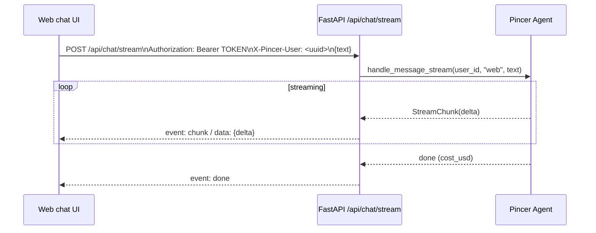

# Web chat integration — task brief

## 1. File to create

- [docs/tasks/web-chat-integration.md](docs/tasks/web-chat-integration.md) — single Markdown brief, no code changes.

## 2. Contents of the brief

The brief will be written so one frontend developer can own it end-to-end (they also build the small FastAPI endpoint). It will contain:

### 2.1 Context & constraints
- No user schema, no auth service — token-based trust only, reusing the pattern in [src/pincer/api/server.py](src/pincer/api/server.py) (`auth_middleware`, `PINCER_DASHBOARD_TOKEN`).
- `ChannelType.WEB` already exists in [src/pincer/channels/base.py](src/pincer/channels/base.py); [src/pincer/channels/web.py](src/pincer/channels/web.py) is an empty stub.
- Agent entry points to call: `Agent.handle_message_stream(user_id, channel="web", text)` and `Agent.handle_message(...)` in [src/pincer/core/agent.py](src/pincer/core/agent.py).

### 2.2 Backend task (FastAPI, SSE)

New router file `src/pincer/api/chat.py`, wired from `create_app()` in [src/pincer/api/server.py](src/pincer/api/server.py). All routes go through the existing bearer middleware automatically (they start with `/api/`).

Endpoints:

- `POST /api/chat/message` — non-streaming fallback. Body `{ "text": string }`. Header `X-Pincer-User: <uuid>` required. Returns `{ "reply": string }`.
- `POST /api/chat/stream` — SSE. Body `{ "text": string }`. Header `X-Pincer-User: <uuid>` required. Response is `text/event-stream` emitting:
  - `event: chunk` / `data: {"delta": "..."}`
  - `event: tool` / `data: {"name": "...", "input": {...}}` (optional, if `StreamChunk` carries tool info)
  - `event: done` / `data: {"cost_usd": number}`
  - `event: error` / `data: {"message": "..."}`
- Reuse existing `GET /api/conversations?channel=web&search=<user_id>` from [src/pincer/api/conversations.py](src/pincer/api/conversations.py) for history — no new endpoint.

Implementation notes to include in the brief:
- Obtain a shared `Agent` via the app lifespan (construct once in `lifespan`, attach to `app.state.agent`).
- Validate `X-Pincer-User` matches a UUID v4 regex; 400 otherwise.
- SSE: use `fastapi.responses.StreamingResponse` with `media_type="text/event-stream"`; set `Cache-Control: no-cache`, `X-Accel-Buffering: no`.
- Iterate `agent.handle_message_stream(user_id, "web", text)` and serialize each `StreamChunk` to an SSE frame. Catch `BudgetExceededError` and emit `event: error`.
- Optional: support a dedicated `PINCER_WEB_CHAT_TOKEN` — if set, accept either that or `PINCER_DASHBOARD_TOKEN` in `auth_middleware`; otherwise keep current behavior.

### 2.3 Frontend task (generic — repo-agnostic)

- Configuration: `VITE_PINCER_API_URL`, `VITE_PINCER_TOKEN` (or a runtime login screen that stores both in `localStorage`, mirroring [dashboard/src/pages/Login.tsx](dashboard/src/pages/Login.tsx)).
- Stable identity: on first load, generate `crypto.randomUUID()`, persist as `pincer.web.userId`. Send as `X-Pincer-User` header on every call.
- HTTP client: send `Authorization: Bearer ${token}` on all requests (see [dashboard/src/api/client.ts](dashboard/src/api/client.ts) for the exact pattern).
- Streaming: since `EventSource` can't set custom headers, use `fetch` + `ReadableStream` and parse SSE manually (snippet provided in the brief). Append `delta`s to the current assistant bubble; close on `event: done`.
- Fallback: if streaming fails (network/proxy), fall back to `POST /api/chat/message`.
- History: on mount, call `GET /api/conversations?channel=web&search=<userId>&limit=1`, then `GET /api/conversations/{id}` to hydrate prior messages.
- Error UX: 401 → clear token and show login; `event: error` → render as system message.

### 2.4 Acceptance criteria
- User pastes API URL + token once; chat persists across reloads.
- Sending a message streams token-by-token from the agent.
- Page survives server restarts (history re-hydrates via conversations API).
- Calling any endpoint without the bearer token returns 401.
- Conversation appears in the dashboard's Conversations page under `channel = web`.

### 2.5 Out of scope (explicit)
- Real user accounts / login with email+password.
- File / voice uploads (mention as follow-up).
- Registering a `WebChannel` in the channel router (not needed for HTTP-only inbound; can be added later for proactive push).

## 3. Diagram included in the brief

