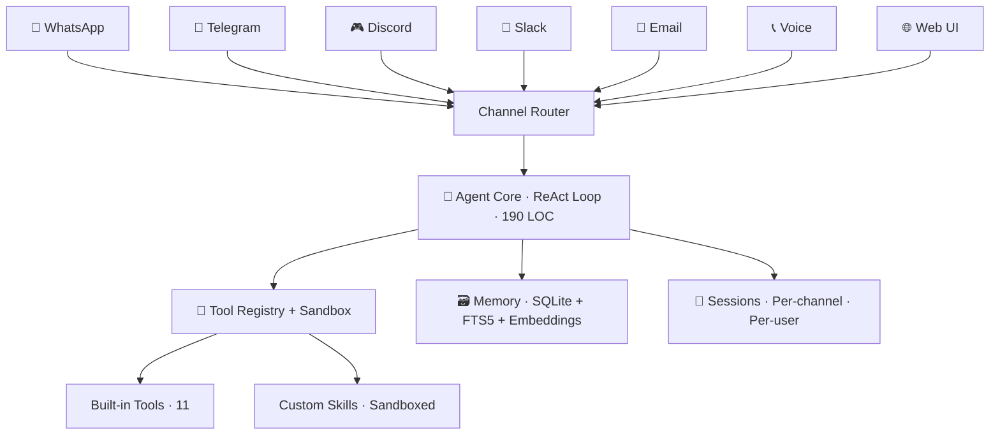

<div align="center">


# Pincer

**Your personal AI agent. Text it. It does stuff.**

[](https://pypi.org/project/pincer-agent/)
[](https://python.org)
[](https://github.com/pincerhq/pincer/actions)
[](https://codecov.io/gh/pincerhq/pincer)
[](LICENSE)
[](https://discord.gg/eM9Y6utd)
[](https://github.com/pincerhq/pincer/stargazers)
[](https://pypi.org/project/pincer-agent/)

<!-- Replace with actual recording: gifski, ScreenToGif, or terminalizer -->


```bash
pip install pincer-agent && pincer init
```

[Website](https://pincer.sh) · [Docs](https://pincer.sh/docs) · [Quick Start](#-quick-start) · [Discord](https://discord.gg/pincer) · [Contributing](CONTRIBUTING.md)

</div>

---

### TL;DR

- **What:** An open-source AI agent that lives in WhatsApp, Telegram, Discord, Slack, and Email — and actually does things (reads email, manages calendar, browses the web, makes phone calls)
- **For whom:** Developers and technical users who want a personal agent they can self-host, audit, and extend
- **Why it exists:** Existing agents had [malicious plugins](https://docs.pincer.dev/security/why), surprise bills, and codebases too large to review
- **How it's different:** 7,800 lines of Python. 12 env vars. Skills sandboxed in subprocesses. Hard daily spending cap
- **How it stays safe:** User allowlist, tool approval prompts, AST scanning, skill signing, structured audit log — and `pincer doctor` to verify it all

---

## What is this?

Pincer is an open-source AI agent that lives in your messaging apps. You text it — *"check my emails, summarize anything important, and add the meetings to my calendar"* — and it does it. It runs on your machine, talks to the LLM of your choice, and the entire codebase is 7,800 lines of Python you can read in an afternoon.

> **You (WhatsApp):** Check my email and brief me on anything important
>
> **🦀 Pincer:**
> 📧 12 unread, 3 need attention:
>
> 1. Contract from Sarah — needs signature by 5pm
> 2. Server alert — CPU spike on prod (resolved itself)
> 3. Board meeting moved to Thursday 2pm
>
> 📅 Updated your calendar:
> • Thu 2pm — Board meeting (moved from Wednesday)
> • Fri 11am — Design review follow-up (new)
>
> 💰 $0.003 · $4.92 remaining today

---

## Why I built this

I was running a popular AI agent when two things happened in the same week: I got hit with a **$127 API bill** I didn't authorize, and a security researcher found that a skill I'd installed had been quietly phoning home with my chat history.

By day, I'm a radiologist — I also research and build AI for the medical sector. When your work involves regulated patient data, seeing a personal AI agent silently exfiltrate conversations hits differently. I realized the agent I wanted didn't exist: one where I could **read the whole codebase**, set a **hard spending cap**, and know that plugins are **strictly sandboxed**.

So I built it. Pincer is the agent I wanted. If you want the same thing, it's yours.

---

## Design Trade-offs Compared

> **Fair comparison note:** OpenClaw is a respected project that proved personal AI agents are what people want. It optimizes for plugin ecosystem breadth and community size. Pincer optimizes for auditability, cost control, and sandboxed security. Different goals, different trade-offs. Versions compared: Pincer 0.7.x vs OpenClaw as of Feb 2026.

|  | **Pincer** | **OpenClaw** | **LangChain agents** | **Custom bot** |
|---|:---:|:---:|:---:|:---:|
| **Codebase** | 7,800 LOC | 200K+ LOC | Framework + glue | Yours |
| **Language** | Python | TypeScript | Python | Any |
| **Install → first message** | ~5 min | 30–60 min | Hours | Days |
| **Skill isolation** | Subprocess sandbox | In-process | DIY | DIY |
| **Skill vetting** | AST scan + safety score + optional signing | Community-reported | DIY | DIY |
| **Cost controls** | Hard daily cap, auto-downgrade, per-response cost | None built-in | None built-in | DIY |
| **Config surface** | 12 env vars | Multi-file JSON | Code | Code |
| **Channels** | 7 + voice calling | 2–3 | 0 | 1 (usually) |
| **Memory** | Cross-channel, FTS5 + embeddings | Per-channel | Needs setup | DIY |

---

## ⚡ Quick Start

### Prerequisites

You need three things: **Python 3.11+**, **an LLM API key** (Anthropic, OpenAI, DeepSeek, or free with Ollama), and **a Telegram bot token** (takes 2 min via [@BotFather](https://t.me/BotFather)).

### Option 1: pip

```bash
pip install pincer-agent
pincer init                  # 5-min interactive wizard
pincer run                   # done — message your bot on Telegram
```

### Option 2: Docker

```bash
git clone https://github.com/pincerhq/pincer.git && cd pincer
cp .env.example .env         # edit with your API keys
docker compose up -d         # dashboard on localhost:8080
```

### Option 3: One-click cloud

[](https://railway.app/template/pincer)
[](https://render.com/deploy?repo=https://github.com/pincerhq/pincer)
[](https://cloud.digitalocean.com/apps/new?repo=https://github.com/pincerhq/pincer)

### Minimal .env

```bash
PINCER_LLM_API_KEY=sk-ant-...          # Anthropic, OpenAI, or DeepSeek
PINCER_TELEGRAM_TOKEN=7000000:AAx...   # From @BotFather
PINCER_ALLOWED_USERS=123456789         # Your Telegram user ID
PINCER_BUDGET_DAILY=5.00               # Hard daily spending limit in USD
```

Twelve env vars total. No JSON. No YAML. **[Full config reference →](docs/configuration.md)**

---

## Core vs Peripheral

Pincer is solo-maintained. To set honest expectations, features are explicitly split:

| Tier | What's included | Maintenance guarantee |
|------|----------------|----------------------|
| **🟢 Core** | Agent loop, memory, tools, security, cost controls, Telegram | CI-tested, regression-protected, release-blocking |
| **🟡 Stable** | WhatsApp, Discord, Slack, Email, dashboard, skills system | Tested, maintained, may lag 1–2 weeks on upstream API changes |
| **🧪 Peripheral** | Voice calling, Signal, proactive scheduler | Working, documented, community-maintained welcome |
| **🔮 Planned** | iMessage, LINE, Teams, Matrix, MCP | Not yet started — [help wanted](https://github.com/pincerhq/pincer/labels/help-wanted) |

---

## 📱 Channels

| Channel | Tier | How it works |
|---------|:----:|------|
| **Telegram** | 🟢 | Bot API via aiogram 3.x — keyboards, voice notes, images, groups |
| **WhatsApp** | 🟡 | Multi-device protocol via neonize — QR pairing, no API costs |
| **Discord** | 🟡 | Slash commands, threads, rich embeds via discord.py |
| **Slack** | 🟡 | DMs, channels, threads via slack-bolt |
| **Email** | 🟡 | Gmail OAuth — read, search, draft, send |
| **Signal** | 🧪 | E2E encrypted via signal-cli |
| **Voice** | 🧪 | Make/receive phone calls via Twilio (~$0.12/3-min call) |
| **Web UI** | 🟡 | Dashboard + chat at `localhost:8080` |

**Cross-channel memory:** Tell the agent something on WhatsApp. Ask about it on Telegram. It remembers — SQLite + FTS5 full-text search, vector embeddings for semantic recall, auto-summarization, and entity extraction.

---

## 🔧 Built-in Tools

| Tool | What it does | Approval required |
|------|-------------|:---------:|
| `web_search` | Search via Tavily or DuckDuckGo | No |
| `web_browse` | Navigate, fill forms, screenshot (Playwright) | No |
| `email_check` / `email_send` | Read inbox, draft and send | Read: No / Send: **Yes** |
| `calendar_today` / `calendar_create` | Read and create Google Calendar events | Read: No / Create: No |
| `shell_exec` | Run shell commands | **Yes** |
| `python_exec` | Execute Python in sandbox | **Yes** |
| `file_read` / `file_write` | Local file operations | Read: No / Write: **Yes** |
| `memory_search` | Search past conversations semantically | No |
| `voice_call` | Outbound phone calls via Twilio | **Yes** |

"Approval" = the agent asks in chat before executing. You reply ✅ or ❌.

<details>
<summary><strong>Python SDK</strong></summary>

```python
from pincer import Agent

agent = Agent()
result = agent.ask("Summarize ~/data/sales.csv and plot monthly trends")
result.display()  # renders inline in Jupyter
```

```python
async with Agent() as agent:
    result = await agent.run("What meetings do I have tomorrow?")
    print(result.text)
    print(f"Cost: ${result.cost:.4f}")
```

</details>

---

## 🧩 Skills

Skills extend the agent. Each skill = a Python file + YAML manifest, loaded dynamically on startup.

```bash
pincer skills list                     # what's installed
pincer skills install github:user/repo # install (scanned first)
pincer skills scan ./untrusted-skill   # security scan before install
```

10 bundled skills ship with Pincer: `weather`, `news`, `translate`, `summarize_url`, `youtube_summary`, `expense_tracker`, `habit_tracker`, `pomodoro`, `stock_price`, `git_status`.

<details>
<summary><strong>Writing your own skill</strong></summary>

```python
# skills/my_skill/main.py
from pincer.tools import tool

@tool(name="get_weather", description="Get current weather for a city")
async def get_weather(city: str) -> str:
    async with httpx.AsyncClient() as client:
        resp = await client.get(f"https://wttr.in/{city}?format=j1")
        data = resp.json()
        return f"{city}: {data['current_condition'][0]['temp_C']}°C"
```

```yaml
# skills/my_skill/skill.yaml
name: weather
version: 1.0.0
permissions: [network]
```

The manifest declares permissions. The sandbox enforces them. No declared permissions = no network, no filesystem, no nothing.

**[Full skills guide →](docs/skills-guide.md)**

</details>

---

## 🛡️ Security & Threat Model

Pincer is designed around two assumptions: **every inbound message is untrusted input**, and **every skill is potentially malicious**.

### What Pincer protects against

| Threat | How |
|--------|-----|
| **Unauthorized access** | User allowlist — unapproved IDs are silently dropped |
| **Destructive tool calls** | Dangerous tools require explicit ✅ approval in chat |
| **Malicious skills** | Subprocess sandbox (memory cap, CPU timeout, filesystem isolation, network whitelist) |
| **Supply-chain attacks** | AST scanning pre-install + optional cryptographic skill signing |
| **Prompt injection via tools** | Tool outputs are sanitized; system prompt is hardened against injection |
| **Runaway costs** | Hard daily budget, per-session limits, auto-downgrade at 80% spend |
| **Forensic blindness** | Structured JSON audit log for every action — who, what, when, cost |

### What Pincer does NOT protect against

- **Compromised host OS** — if your server is rooted, all bets are off
- **Malicious LLM provider** — if the API itself is compromised, Pincer can't detect that
- **Social engineering of the user** — Pincer can't stop you from approving a bad tool call
- **Side-channel exfiltration** — a skill that encodes data into tool output text could leak information to the LLM context; we mitigate but can't fully prevent this

### Honest trade-offs

Sandboxing adds **40–120ms latency** per tool call (subprocess spawn + IPC). For most use cases this is unnoticeable. For latency-critical pipelines, you can disable sandboxing per-skill at your own risk via `sandbox: false` in the manifest.

### Real-world failure example

If the LLM attempts to exfiltrate data by crafting a `web_search` query containing sensitive content (e.g., `web_search("user's SSN is 123-45-6789")`), the query executes — Pincer doesn't inspect tool *input* semantics, only permissions. Mitigation: the audit log captures every tool call, and `pincer doctor` flags unusual outbound patterns. Full prevention requires output filtering, which is on the roadmap.

### `pincer doctor`

One command audits your setup — 25+ checks covering config, keys, permissions, skills, and network exposure:

```
$ pincer doctor
  🦀 Pincer Doctor v0.7.0
  ✅ API key valid (claude-sonnet-4-5-20250929)
  ✅ Telegram connected (@my_pincer_bot)
  ✅ Daily budget: $5.00
  ✅ 10 skills installed, all scored ≥ 80
  ⚠️  Discord DM policy is "open" — consider "pairing"
  ✅ No exposed ports beyond localhost
  22 passed · 1 warning · 0 critical
```

**[Full security model →](docs/security.md)** · Found a vulnerability? **[SECURITY.md](SECURITY.md)**

---

## 📊 Quantified Use Cases

**Personal email triage (real numbers from beta testing):**
- 40–60 emails/day processed, 3–5 flagged as important
- Calendar auto-updated 2–3 times/day
- Daily LLM cost: **$0.18–$0.35** (Claude Sonnet 4.5)
- Monthly: **~$7** with daily budget cap of $0.50

**Voice calling for appointments:**
- 4 outbound calls/week (dentist, insurance, scheduling)
- Average call duration: 2.5 minutes
- Cost per call: **~$0.12** (Twilio + Deepgram + ElevenLabs)
- Monthly voice cost: **~$2**

**Fully offline with Ollama:**
- Llama 3.3 70B via Ollama on an M2 Mac
- API cost: **$0.00**. Response time: 3–8 seconds depending on context length
- Trade-off: less reliable tool use than Claude, no voice calling

---

## Who this is NOT for

- **Non-technical users** — Pincer requires terminal access, env vars, and API keys. There's no GUI installer.
- **Enterprises needing SSO/compliance today** — multi-user, audit export, and SSO are planned but not shipped yet.
- **Zero-setup expectations** — you will spend 5–10 minutes configuring API keys and channel tokens.
- **People who want a hosted service** — Pincer runs on your machine. Managed hosting is on the roadmap, not available today.

---

## What we intentionally didn't build

- **No hosted cloud** — your data stays on your hardware. We're not a SaaS.
- **No auto-installed skills** — every skill requires explicit `pincer skills install` with a security scan.
- **No team features** — Pincer is a single-user personal agent. Multi-user is planned, not promised.
- **No telemetry** — zero analytics, zero crash reports, zero phone-home. Verify: `grep -r "telemetry\|analytics\|tracking" src/`.
- **No framework dependency** — no LangChain, no CrewAI, no abstractions. Pure `asyncio` + provider SDKs.

These are focus decisions, not limitations. Every feature we didn't build is maintenance we didn't take on.

---

<details>
<summary><strong>🤖 Supported Models</strong></summary>

Set one or more — failover is automatic.

| Provider | Env var | Models |
|----------|---------|--------|
| **Anthropic** ⭐ | `PINCER_LLM_API_KEY` | Claude Opus 4.6 / Sonnet 4.5 / Haiku 4.5 |
| **OpenAI** | `PINCER_LLM_API_KEY` | GPT-4o / GPT-5 / o-series |
| **DeepSeek** | `PINCER_LLM_API_KEY` | DeepSeek V3 / R1 |
| **Ollama** | `OLLAMA_HOST` | Any local model — fully offline, $0 |
| **OpenRouter** | `PINCER_LLM_API_KEY` | 100+ models, single key |

**Recommendation:** Claude Sonnet 4.5 for tool-use quality and prompt-injection resistance. Ollama for zero-cost, fully private operation.

</details>

<details>
<summary><strong>⏰ Proactive Agent</strong></summary>

Pincer doesn't just respond — it reaches out.

**Morning briefing** (7 AM, configurable): weather, today's calendar, top 3 emails, habit check-in.

**Scheduled tasks:** `"Remind me every Friday at 5pm to submit my timesheet"` → cron-scheduled with full cron syntax support.

**Event triggers:** Gmail pub/sub for real-time email reactions, webhooks from any service.

</details>

<details>
<summary><strong>💻 CLI Reference</strong></summary>

```bash
pincer init                        # interactive setup wizard
pincer run                         # start agent (all channels)
pincer run --channel telegram      # single channel
pincer chat                        # CLI chat for testing
pincer doctor                      # security + config audit
pincer cost                        # spending summary
pincer skills list|install|scan    # manage skills
pincer pair approve <ch> <code>    # approve a DM sender
pincer google setup                # Google Calendar/Gmail OAuth
```

**Chat commands** (any channel): `/status`, `/budget`, `/new`, `/compact`, `/model <name>`, `/tools`

</details>

---

## 🏛️ Architecture



1. Message arrives → load session + relevant memories
2. Send to LLM with available tools
3. LLM returns tool call → execute in sandbox → feed result back → repeat
4. LLM returns text → deliver to user via originating channel
5. Save session, update memory, log cost

No frameworks. No abstractions. `async/await` + the Anthropic SDK.

<details>
<summary><strong>Project structure & tech stack</strong></summary>

```
pincer/ (7,800 LOC total)
├── src/pincer/
│   ├── core/         agent.py (190 LOC), session.py, config.py, soul.py
│   ├── llm/          anthropic, openai, ollama, router, cost_tracker
│   ├── channels/     telegram, whatsapp, discord, slack, email, voice, web
│   ├── memory/       store (SQLite+FTS5), embeddings, entities
│   ├── tools/        registry, sandbox, approval, builtin/ (11 tools)
│   ├── skills/       loader, scanner (AST), signer
│   ├── voice/        engine, twiml_server, stt, tts, compliance
│   ├── security/     firewall, audit, doctor (25+ checks)
│   └── scheduler/    cron, proactive
├── skills/           10 bundled
├── tests/            pytest + pytest-asyncio
└── docs/
```

**Stack:** Python 3.11+ / asyncio · `anthropic` + `openai` SDKs · `aiogram` 3.x · `neonize` · `discord.py` · `slack-bolt` · `twilio` · `FastAPI` + `HTMX` · SQLite + FTS5 · `Playwright` · `pydantic-settings` · `typer` + `rich`

</details>

---

## 🗺️ Roadmap

- [x] Agent core, memory, tools, security, cost controls
- [x] Telegram, WhatsApp, Discord, Slack, Email, Signal
- [x] Skill system with sandboxing, AST scanning, signing
- [x] Docker + one-click deploys (Railway, Render, DigitalOcean)
- [x] Voice calling (Twilio + STT/TTS + compliance)
- [ ] **MCP support** — Model Context Protocol integration
- [ ] **iMessage** — [help wanted](https://github.com/pincerhq/pincer/issues?q=label%3A%22help+wanted%22)
- [ ] **Encrypted memory** — at-rest database encryption
- [ ] **Multi-agent routing** — specialized sub-agents
- [ ] **Managed hosting** — for non-self-hosters (exploring, not promised)

Full roadmap: [GitHub Discussions → Roadmap](https://github.com/pincerhq/pincer/discussions/categories/roadmap)

---

## Sustainability

Pincer is solo-maintained, open-source, and unfunded. That's a feature, not a weakness — no investor pressure means no forced pivots, no telemetry, no "free tier sunsets."

The plan: grow the contributor community, move toward shared governance as trust is established (see [GOVERNANCE.md](GOVERNANCE.md)), and eventually explore a managed hosting option to fund ongoing maintenance. Nothing is promised beyond what's shipped today.

---

## 🤝 Community

We welcome contributions from everyone — first-timers, experienced engineers, doctors who code, tinkerers, and vibe-coders.

| What | How | Difficulty |
|------|-----|:----------:|
| **Build a skill** | [Skills guide](docs/skills-guide.md) — 50–150 lines | 🟢 Easy |
| **Improve docs** | Fix what confused you, translate, write a tutorial | 🟢 Easy |
| **New channel** | Signal, iMessage, LINE, Matrix | 🟡 Medium |
| **Core features** | MCP, encrypted memory, multi-agent | 🔴 Hard |

```bash
git clone https://github.com/pincerhq/pincer.git
cd pincer && uv sync && pytest
```

[**Discord**](https://discord.gg/pincer) · [**GitHub Discussions**](https://github.com/pincerhq/pincer/discussions) · [**Contributing guide**](CONTRIBUTING.md) · [**Governance**](GOVERNANCE.md)

---

## 📖 Documentation

| Doc | What's in it |
|-----|-------------|
| **[Quick Start](docs/quickstart.md)** | Install to first message in 5 minutes |
| **[Architecture](docs/architecture.md)** | How it works, with Mermaid diagrams |
| **[Configuration](docs/configuration.md)** | Every env var, every option |
| **[Skills Guide](docs/skills-guide.md)** | Build and publish custom skills |
| **[Security Model](docs/security.md)** | Full threat model, 8 defense layers |
| **[Deployment](docs/deployment.md)** | Docker, cloud, systemd, reverse proxy |
| **[Voice Calling](docs/voice-calling.md)** | Twilio setup, STT/TTS, compliance |
| **[API Reference](docs/api-reference.md)** | REST API for integrations |
| **[Migrating from OpenClaw](docs/migrating-from-openclaw.md)** | Import your data in 30 min |

---

## 🙏 Acknowledgements

[Anthropic](https://anthropic.com) · [aiogram](https://github.com/aiogram/aiogram) · [neonize](https://github.com/krypton-byte/neonize) · [discord.py](https://github.com/Rapptz/discord.py) · [Twilio](https://twilio.com) · [Deepgram](https://deepgram.com) · [ElevenLabs](https://elevenlabs.io) · [Playwright](https://playwright.dev/) · [Rich](https://github.com/Textualize/rich) · [Typer](https://github.com/tiangolo/typer) · [OpenClaw](https://github.com/openclaw/openclaw) — for proving personal AI agents are what people want · Every beta tester and contributor who helped ship this

---

📜 **License:** MIT — [LICENSE](LICENSE) · 🔐 **Security:** [SECURITY.md](SECURITY.md) — do not open public issues for vulnerabilities

---

<div align="center">

🦀 **Built with Python and vibe coding.**

[pincer.dev](https://pincer.dev) · [GitHub](https://github.com/pincerhq/pincer) · [Discord](https://discord.gg/pincer) · [Twitter](https://twitter.com/pincerhq)

If Pincer is useful to you, consider [giving it a ⭐](https://github.com/pincerhq/pincer) — it helps others discover the project.

</div>
