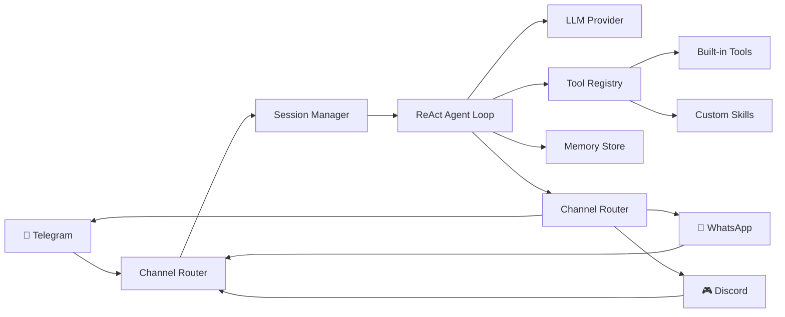
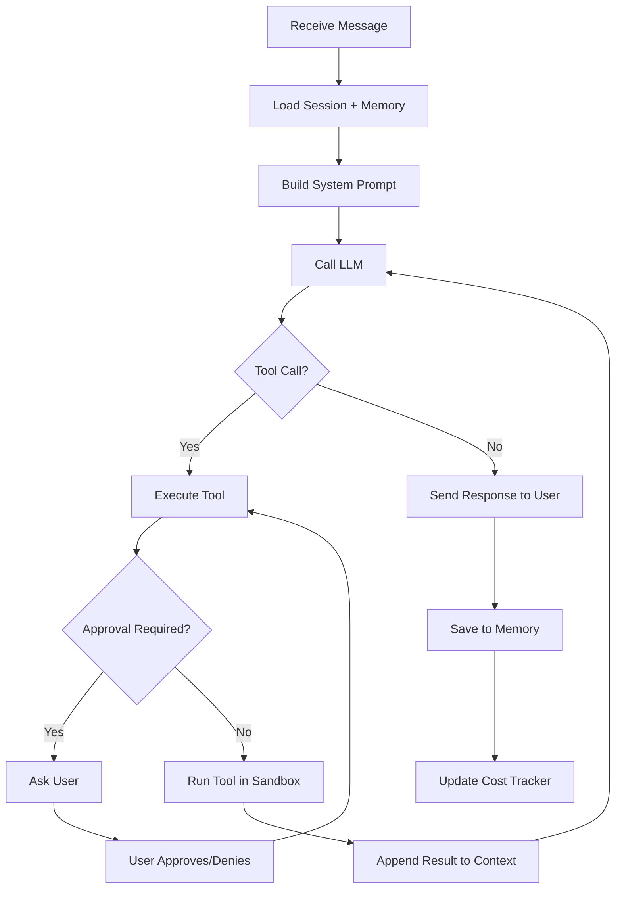
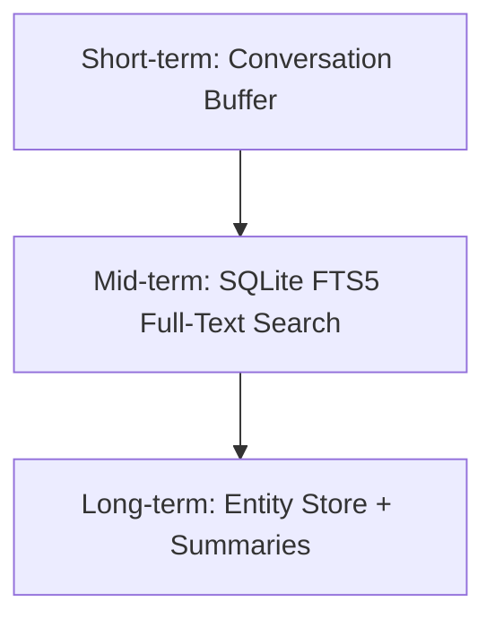

# 🏗️ Architecture

A deep dive into how Pincer works under the hood. Read this if you want to contribute, build skills, or just understand the system.

---

## High-Level Overview

Pincer follows a simple pipeline: **Message in → Agent thinks → Tools execute → Response out**.



Everything is async Python (`asyncio`). There's no queue, no microservices, no Kubernetes. One process, one database, one config file.

---

## Core Components

### 1. Channels (`src/pincer/channels/`)

Channels handle the transport layer — receiving messages from users and sending responses back. Each channel implements the `BaseChannel` abstract class:

```python
class BaseChannel(ABC):
    async def start(self) -> None: ...
    async def stop(self) -> None: ...
    async def send_message(self, user_id: str, content: MessageContent) -> None: ...
    async def on_message(self, callback: MessageCallback) -> None: ...
```

Supported channels:

| Channel | Library | Protocol | Auth Method |
|---------|---------|----------|-------------|
| Telegram | `aiogram 3.x` | Bot API (HTTPS polling/webhook) | Bot token via BotFather |
| WhatsApp | `neonize` | Multi-device protocol (WebSocket) | QR code scan |
| Discord | `discord.py 2.x` | Gateway WebSocket | Bot token via Developer Portal |
| Email | `aiosmtplib` + `aioimaplib` | IMAP/SMTP | Google OAuth2 |
| Web | `FastAPI WebSocket` | WebSocket | Dashboard auth token |
| Voice | `twilio` | TwiML + WebSocket media streams | Twilio account SID + auth token |

All channels normalize messages into a common `IncomingMessage` model before passing to the agent.

### 2. Session Manager (`src/pincer/core/session.py`)

Each conversation gets a `Session` that tracks:

- Conversation history (last N messages, configurable)
- User identity and permissions
- Active tool calls awaiting approval
- Cost accumulator for this session
- Channel-specific metadata

Sessions are persisted to SQLite so conversations survive restarts.

### 3. ReAct Agent Loop (`src/pincer/core/agent.py`)

The core intelligence. Pincer uses a ReAct (Reasoning + Acting) loop:



Key design decisions:

- **Max 10 tool calls per turn** — prevents runaway loops
- **Streaming responses** — partial responses sent as the LLM generates them
- **System prompt is composable** — base personality + active tools + relevant memories + user preferences
- **Multi-model fallback** — if Claude fails, try OpenAI; if budget tight, downgrade model

### 4. LLM Providers (`src/pincer/llm/`)

Abstracted behind a `BaseLLMProvider` interface:

```python
class BaseLLMProvider(ABC):
    async def complete(
        self, messages: list[Message], tools: list[Tool], **kwargs
    ) -> LLMResponse: ...
    
    async def stream(
        self, messages: list[Message], tools: list[Tool], **kwargs
    ) -> AsyncIterator[StreamChunk]: ...
```

Supported providers:

| Provider | Models | Best For |
|----------|--------|----------|
| Anthropic | Claude Opus, Sonnet, Haiku | Primary — best tool use |
| OpenAI | GPT-4o, GPT-4o-mini | Fallback, vision tasks |
| Ollama | Llama, Mistral, etc. | Local/offline, privacy-sensitive |
| OpenRouter | Any model | Flexibility, cost optimization |
| DeepSeek | DeepSeek-V3, R1 | Budget-friendly, coding |

### 5. Tool System (`src/pincer/tools/`)

Tools are Python functions decorated with `@tool`:

```python
from pincer.tools import tool

@tool(
    name="web_search",
    description="Search the web and return results",
    requires_approval=False,
)
async def web_search(query: str, num_results: int = 5) -> str:
    ...
```

The tool registry handles:
- **Discovery** — scans `tools/builtin/` and `skills/` directories
- **Schema generation** — auto-generates JSON schema from type hints for LLM function calling
- **Sandboxing** — tools run in subprocess isolation (configurable)
- **Approval flow** — dangerous tools (shell, file write) require user confirmation via chat
- **Cost tracking** — each tool call's token usage is logged

Built-in tools (Sprint 1-6):

| Tool | Category | Approval Required |
|------|----------|-------------------|
| `web_search` | Information | No |
| `web_browse` | Information | No |
| `shell_exec` | System | **Yes** |
| `file_read` | System | No |
| `file_write` | System | **Yes** |
| `python_exec` | Code | **Yes** |
| `gmail_read` | Email | No |
| `gmail_send` | Email | **Yes** |
| `calendar_read` | Calendar | No |
| `calendar_create` | Calendar | No |
| `screenshot` | Browser | No |
| `memory_search` | Internal | No |

### 6. Memory System (`src/pincer/memory/`)

Pincer's memory is SQLite-based with three layers:



- **Short-term** — last N messages in the current session (in-memory)
- **Mid-term** — all conversations searchable via FTS5 (SQLite full-text search)
- **Long-term** — extracted entities (people, places, projects) and auto-generated conversation summaries

The agent automatically searches memory when context seems relevant — no explicit command needed.

### 7. Security Layer (`src/pincer/security/`)

Security is not an afterthought — it's a core design principle:

- **User allowlist** — only approved user IDs can interact with the agent
- **Tool approval** — dangerous operations require explicit user confirmation
- **Skill sandboxing** — skills run in subprocess isolation with resource limits
- **Skill signing** — optional cryptographic signing to verify skill integrity
- **Audit log** — every action (tool calls, LLM requests, approvals) is logged
- **Rate limiting** — per-user and global rate limits prevent abuse
- **Security Doctor** — `pincer doctor` runs 25+ automated security checks
- **No secrets in logs** — API keys and tokens are masked in all output

### 8. Cost Controls (`src/pincer/llm/cost_tracker.py`)

Pincer tracks every token:

- **Daily budget** — hard limit, default $5/day
- **Per-conversation limit** — default $1/conversation
- **Per-tool-call limit** — default $0.50/call
- **Auto-downgrade** — when budget is tight, automatically switch to cheaper model
- **Notifications** — alerts at 80% and 100% of budget
- **Dashboard** — real-time spend visibility via web UI

---

## Data Flow Example

Here's what happens when you send "Summarize my unread emails" to Pincer on Telegram:

1. **Telegram channel** receives the message via Bot API polling
2. **Channel router** normalizes it into an `IncomingMessage`
3. **Session manager** loads/creates a session for your user ID
4. **Agent** builds a system prompt with your personality, available tools, and relevant memories
5. **LLM call** — Claude sees the tools and decides to call `gmail_read(query="is:unread", max_results=10)`
6. **Tool registry** checks: `gmail_read` doesn't require approval → execute directly
7. **Gmail tool** fetches 10 unread emails via Google API, returns formatted text
8. **Agent** appends the tool result to the conversation and calls the LLM again
9. **LLM** generates a summary of the emails
10. **Telegram channel** sends the summary back to you
11. **Memory store** saves the conversation turn
12. **Cost tracker** logs: 2 LLM calls, ~2,000 tokens, ~$0.008

Total time: 3-5 seconds.

---

## Directory Structure

```
pincer/
├── pyproject.toml                  # Package config
├── Dockerfile                      # Multi-stage Docker build
├── docker-compose.yml              # One-command deployment
├── .env.example                    # All configuration options
├── README.md
│
├── src/pincer/
│   ├── __init__.py
│   ├── __main__.py                 # `python -m pincer`
│   ├── cli.py                      # Typer CLI (init, run, doctor, skills)
│   ├── config.py                   # Pydantic settings (env → typed config)
│   ├── exceptions.py               # Custom exception hierarchy
│   │
│   ├── core/
│   │   ├── agent.py                # ReAct agent loop
│   │   ├── session.py              # Conversation session manager
│   │   ├── events.py               # Internal pub/sub event bus
│   │   └── soul.py                 # System prompt / personality loader
│   │
│   ├── llm/
│   │   ├── base.py                 # Abstract LLM provider
│   │   ├── anthropic_provider.py   # Claude
│   │   ├── openai_provider.py      # GPT
│   │   ├── ollama_provider.py      # Local models
│   │   ├── openrouter_provider.py  # Multi-model gateway
│   │   └── cost_tracker.py         # Token counting + budget enforcement
│   │
│   ├── channels/
│   │   ├── base.py                 # Abstract channel
│   │   ├── telegram.py             # aiogram 3.x
│   │   ├── whatsapp.py             # neonize
│   │   ├── discord.py              # discord.py 2.x
│   │   ├── email.py                # IMAP/SMTP
│   │   ├── voice.py                # Twilio voice (Sprint 7)
│   │   └── web.py                  # WebSocket for dashboard
│   │
│   ├── memory/
│   │   ├── store.py                # SQLite + FTS5
│   │   ├── embeddings.py           # Vector search (sqlite-vec)
│   │   ├── summarizer.py           # Auto-summarize old conversations
│   │   └── entities.py             # Entity extraction
│   │
│   ├── tools/
│   │   ├── registry.py             # Tool discovery + schema gen
│   │   ├── sandbox.py              # Subprocess isolation
│   │   ├── approval.py             # User approval flow
│   │   └── builtin/                # 12+ built-in tools
│   │
│   ├── skills/
│   │   ├── loader.py               # Skill discovery + loading
│   │   ├── scanner.py              # Security scanner
│   │   └── signer.py               # Cryptographic signing
│   │
│   ├── security/
│   │   ├── firewall.py             # User allowlist + rate limiting
│   │   ├── audit.py                # Action audit log
│   │   └── doctor.py               # 25+ automated security checks
│   │
│   ├── voice/                      # Sprint 7
│   │   ├── engine.py               # Voice engine abstraction
│   │   ├── twiml_server.py         # Twilio webhook handler
│   │   ├── stt.py                  # Speech-to-text providers
│   │   ├── tts.py                  # Text-to-speech providers
│   │   ├── state_machine.py        # Call state management
│   │   └── compliance.py           # Recording consent + PII protection
│   │
│   └── dashboard/
│       ├── app.py                  # FastAPI server
│       ├── templates/              # Jinja2 + HTMX templates
│       └── static/                 # Minimal CSS/JS
│
├── skills/                         # User-installed skills directory
│   └── example_skill/
│       ├── skill.yaml
│       └── main.py
│
├── data/                           # Created at runtime
│   ├── pincer.db                   # SQLite database
│   ├── google_tokens.json          # OAuth tokens
│   └── logs/                       # Structured logs
│
├── tests/                          # pytest + pytest-asyncio
│
└── docs/                           # You are here
```

---

## Tech Stack

| Component | Technology | Why |
|-----------|-----------|-----|
| Language | Python 3.11+ | Largest dev community, async/await, type hints |
| Package manager | `uv` | 10-100× faster than pip |
| Config | `pydantic-settings` | Type-safe, `.env` loading, validation |
| LLM (primary) | `anthropic` SDK | Best tool use, streaming, async |
| Telegram | `aiogram 3.x` | Async-native, Router pattern, mature |
| WhatsApp | `neonize` | Multi-device protocol, no API costs |
| Discord | `discord.py 2.x` | Standard, well-maintained |
| Database | `aiosqlite` + FTS5 | Zero-config, async, full-text search built in |
| Web UI | `FastAPI` + `HTMX` + `Jinja2` | No frontend build step, server-rendered |
| CLI | `typer` + `rich` | Auto-complete, colored output |
| Voice | `twilio` | Reliable telephony, WebSocket media streams |
| Testing | `pytest` + `pytest-asyncio` | Standard Python testing |
| CI | GitHub Actions | Free for open source |
| Container | Docker + multi-stage build | ~150MB final image |