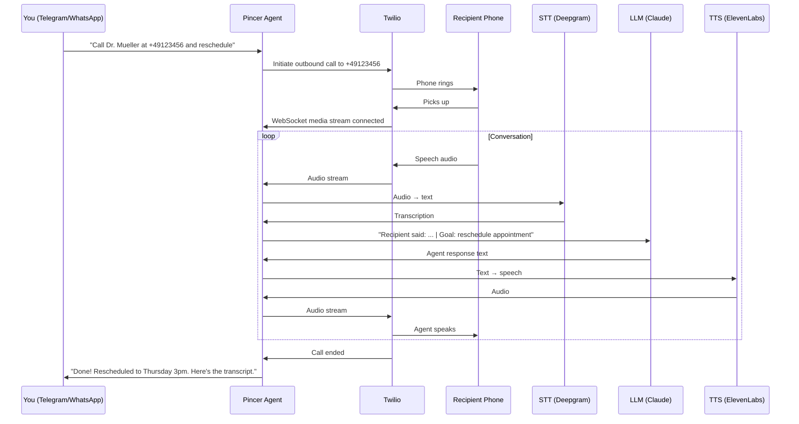

# 📞 Voice Calling

Pincer can make and receive phone calls on your behalf using Twilio. Text your agent "Call the dentist and reschedule my appointment" — it actually dials the number and talks.

> **Status:** Sprint 7 feature. Requires Twilio account.

---

## How It Works



---

## Setup

### 1. Get a Twilio Account

1. Sign up at [twilio.com](https://www.twilio.com)
2. Get a phone number with voice capabilities
3. Note your Account SID and Auth Token

### 2. Configure Pincer

```env
PINCER_VOICE_ENABLED=true
PINCER_TWILIO_ACCOUNT_SID=ACxxxxxxxxxxxxxxxxxxxxxxxxxxxxxxxx
PINCER_TWILIO_AUTH_TOKEN=your-auth-token
PINCER_TWILIO_PHONE_NUMBER=+1234567890
```

### 3. Configure STT/TTS Providers

**Speech-to-Text** (what the recipient says → text):

```env
PINCER_VOICE_STT_PROVIDER=deepgram     # deepgram, whisper, google
PINCER_DEEPGRAM_API_KEY=your-key       # If using Deepgram
```

**Text-to-Speech** (agent's words → voice):

```env
PINCER_VOICE_TTS_PROVIDER=elevenlabs   # elevenlabs, openai, google
PINCER_ELEVENLABS_API_KEY=your-key     # If using ElevenLabs
PINCER_VOICE_TTS_VOICE_ID=pNInz6...   # Optional: specific voice ID
```

### 4. Set Up Webhook URL

Twilio needs to reach your Pincer instance via HTTPS:

```env
PINCER_VOICE_WEBHOOK_URL=https://pincer.yourdomain.com/voice/twiml
```

If running locally, use ngrok for testing:

```bash
ngrok http 8080
# Copy the https URL to PINCER_VOICE_WEBHOOK_URL
```

### 5. Configure Twilio Webhook

In the Twilio Console, set your phone number's Voice webhook to:
```
https://pincer.yourdomain.com/voice/twiml
```

---

## Usage

### Outbound Calls

Text your agent:

```
Call +49 176 12345678 and ask about my prescription refill
```

The agent will:
1. Validate the phone number
2. Ask for your approval before dialing
3. Make the call
4. Conduct the conversation based on your instructions
5. Report back with a summary and transcript

### Inbound Calls

When someone calls your Twilio number, Pincer:
1. Plays a consent announcement (if enabled)
2. Greets the caller
3. Handles the conversation using your configured personality
4. Notifies you on your preferred channel with a summary

---

## Safety & Compliance

### Recording Consent

```env
PINCER_VOICE_RECORDING_CONSENT=true
```

When enabled, every call begins with: "This call may be recorded for quality purposes. Press 1 to continue or hang up to decline."

### Call Duration Limits

```env
PINCER_VOICE_MAX_CALL_DURATION=600   # 10 minutes max
```

### PII Protection

Transcripts are automatically scanned for PII (phone numbers, SSNs, credit card numbers) and masked before storage:

```
Original: "My card number is 4532 1234 5678 9012"
Stored:   "My card number is [CREDIT_CARD_REDACTED]"
```

### Outbound Call Approval

All outbound calls require explicit user approval:

```
📞 Outbound Call Request
  To: +49 176 12345678
  Purpose: Reschedule dentist appointment
  
  Approve? Reply ✅ or ❌
```

---

## Voice Providers Comparison

### Speech-to-Text

| Provider | Latency | Accuracy | Cost | Best For |
|----------|---------|----------|------|----------|
| Deepgram | ~300ms | Excellent | $0.0043/min | Default — best balance |
| Whisper (OpenAI) | ~500ms | Excellent | $0.006/min | Multilingual |
| Google STT | ~400ms | Good | $0.006/min | Enterprise compliance |

### Text-to-Speech

| Provider | Latency | Quality | Cost | Best For |
|----------|---------|---------|------|----------|
| ElevenLabs | ~400ms | Most natural | $0.18/1K chars | Default — best quality |
| OpenAI TTS | ~300ms | Good | $0.015/1K chars | Budget-friendly |
| Google TTS | ~200ms | Robotic | $0.004/1K chars | Lowest cost |

---

## Architecture

The voice system adds these components:

- **TwiML Server** (`voice/twiml_server.py`) — handles Twilio webhooks
- **Voice Engine** (`voice/engine.py`) — manages call state and audio pipeline
- **STT Providers** (`voice/stt.py`) — speech-to-text abstraction
- **TTS Providers** (`voice/tts.py`) — text-to-speech abstraction
- **State Machine** (`voice/state_machine.py`) — call lifecycle management
- **Barge-in Controller** (`voice/bargein.py`) — interrupt handling when caller speaks over agent
- **Compliance** (`voice/compliance.py`) — consent, PII masking, call limits

---

## Costs

A typical 3-minute outbound call costs approximately:

| Component | Cost |
|-----------|------|
| Twilio voice | ~$0.04 |
| STT (Deepgram) | ~$0.013 |
| TTS (ElevenLabs) | ~$0.05 |
| LLM (Claude Haiku) | ~$0.02 |
| **Total** | **~$0.12/call** |

Budget controls apply to voice calls the same as text interactions.