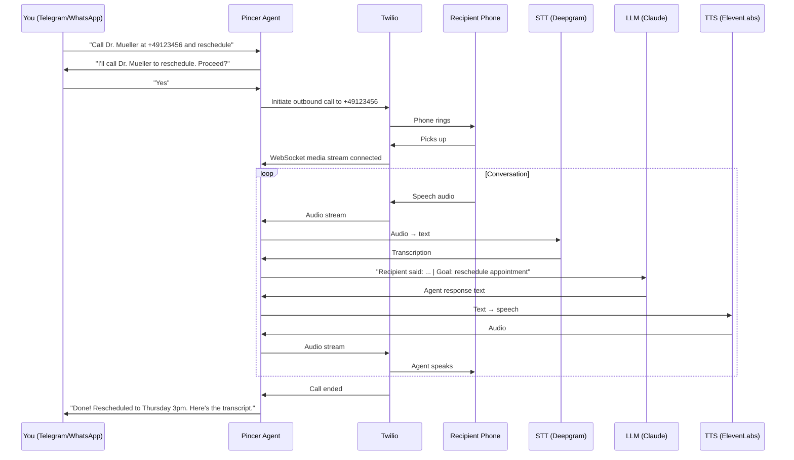

# Voice Calling

Pincer can make and receive phone calls on your behalf using Twilio. Text your agent "Call the dentist and reschedule my appointment" — it actually dials the number and talks.

> **Version:** 0.7.2 (Sprint 7). Requires Twilio account.

---

## How It Works



---

## Architecture

The voice system runs as a new channel alongside Telegram, WhatsApp, and Discord:

```
PSTN Caller / Outbound Target
        │
   Twilio Voice Platform
   ├─ TwiML Server (FastAPI routes)    ← /voice/webhook, /voice/status
   ├─ ConversationRelay (Phase 1)      ← Twilio handles STT/TTS, text webhook
   └─ Media Streams WS (Phase 2)       ← Raw mu-law audio, custom STT/TTS
        │
   Voice Gateway
   ├─ STT Engine (Deepgram)            ← Streaming transcription
   ├─ TTS Engine (ElevenLabs)          ← Streaming synthesis
   └─ Barge-In Controller              ← VAD-based interrupt detection
        │
   Voice Agent Brain
   ├─ Call State Machine               ← greeting → intent → verify → execute → confirm → end
   ├─ Safety Gates                     ← Mandatory confirmation before actions
   ├─ PII Guard                        ← Mask sensitive data in transcripts
   └─ Transcript Logger                ← Real-time logging + post-call summary
        │
   Existing Pincer Core
   ├─ Agent (ReAct loop)
   ├─ Memory Store
   ├─ Tool Registry (25+ tools)
   └─ Channel Router
```

### Two-Phase Engine

| Aspect | ConversationRelay (Phase 1) | Media Streams (Phase 2) |
|--------|----------------------------|------------------------|
| Complexity | Low — text in/out | High — raw audio |
| Latency | ~2-3s | ~0.8-1.5s |
| Voice quality | Twilio default | ElevenLabs custom voices |
| Barge-in | Basic (Twilio handles) | Advanced (custom VAD) |
| Dependencies | twilio only | twilio + deepgram + elevenlabs |

Set `PINCER_VOICE_ENGINE=conversation_relay` (default) or `PINCER_VOICE_ENGINE=media_streams`.

---

## Setup

### 1. Install Voice Dependencies

```bash
uv pip install 'pincer-agent[voice]'
```

### 2. Get a Twilio Account

1. Sign up at [twilio.com](https://www.twilio.com)
2. Get a phone number with voice capabilities
3. Note your Account SID and Auth Token

### 3. Configure Pincer

```env
PINCER_VOICE_ENABLED=true
PINCER_TWILIO_ACCOUNT_SID=ACxxxxxxxxxxxxxxxxxxxxxxxxxxxxxxxx
PINCER_TWILIO_AUTH_TOKEN=your-auth-token
PINCER_TWILIO_PHONE_NUMBER=+1234567890
PINCER_VOICE_WEBHOOK_BASE_URL=https://pincer.yourdomain.com
```

### 4. Configure STT/TTS Providers (Phase 2 only)

```env
PINCER_VOICE_ENGINE=media_streams
PINCER_DEEPGRAM_API_KEY=your-deepgram-key
PINCER_ELEVENLABS_API_KEY=your-elevenlabs-key
PINCER_ELEVENLABS_VOICE_ID=pNInz6...    # Optional: specific voice
```

### 5. Set Up Webhook URL

Twilio needs to reach your Pincer instance via HTTPS. Configure your phone number's Voice webhook to:

```
https://pincer.yourdomain.com/voice/webhook
```

For local development, use ngrok:

```bash
ngrok http 8080
# Copy the https URL to PINCER_VOICE_WEBHOOK_BASE_URL
```

### 6. Verify Setup

```bash
pincer doctor
```

The doctor checks Twilio credentials, webhook URL, and recording consent configuration.

---

## Text-Initiated Outbound Calls (Minimal Setup)

If you only want the agent to place calls when you text "Call my dentist" (and do not need inbound calls), use this minimal setup:

**Required:**

- `PINCER_VOICE_OUTBOUND_ENABLED=true`
- `PINCER_TWILIO_ACCOUNT_SID=AC...`
- `PINCER_TWILIO_AUTH_TOKEN=...`
- `PINCER_TWILIO_PHONE_NUMBER=+1...`
- `PINCER_VOICE_WEBHOOK_BASE_URL=https://your-ngrok-or-domain` (public HTTPS URL)
- `uv pip install 'pincer-agent[voice]'`

**Optional:** `PINCER_VOICE_ENABLED=true` — only needed if you want users to call your Twilio number directly (inbound).

**Approval:** The `make_phone_call` tool requires approval on Telegram (you must confirm before the call is placed). On WhatsApp and Discord, it auto-approves.

---

## Usage

### Inbound Calls

Call your Twilio phone number. The agent:
1. Plays a consent announcement (if enabled)
2. Greets the caller
3. Handles the conversation using tools and memory
4. Sends a post-call summary to your preferred text channel

### Outbound Calls

Text your agent on any channel:

```
Call +49 176 12345678 and ask about my prescription refill
```

The agent will:
1. Validate the phone number
2. Ask for your confirmation before dialing
3. Place the call via Twilio
4. Navigate IVR menus if needed
5. Conduct the conversation based on your instructions
6. Report back with a summary and transcript

### Warm Transfer

The agent can call a provider, navigate to the right person, and then patch you in:

```
Call my insurance company at +1-800-555-0123 and get me to the claims department
```

The agent navigates the IVR, waits on hold, and connects you once a human is available.

---

## Call State Machine

Every call follows a deterministic flow:

| Phase | Purpose | Timeout |
|-------|---------|---------|
| RINGING | Call connecting | 30s |
| GREETING | Agent introduces itself | 15s |
| INTENT_CAPTURE | Understand caller's request | 120s |
| FREEFORM | Open conversation (Q&A) | 300s |
| VERIFY | Confirm details before action | 60s |
| EXECUTE | Perform tool call | 30s |
| CONFIRM | Report result | 30s |
| ERROR_RECOVERY | Handle failures gracefully | 30s |
| ENDING | Summarize + goodbye | 15s |

Every tool execution MUST pass through VERIFY first — no silent actions.

---

## Safety & Compliance

### Recording Consent

```env
PINCER_VOICE_RECORDING_ENABLED=true
PINCER_VOICE_CONSENT_MODE=one_party    # one_party | two_party | none
```

When enabled, every call begins with a consent announcement. Two-party consent states (California, etc.) get stricter announcements requiring explicit agreement.

### Confirmation Gates

All consequential actions require verbal confirmation:

| Action | Confirmation Pattern |
|--------|---------------------|
| Spending money | "This will cost $X. Should I go ahead?" |
| Scheduling | "I'll book [date/time]. Confirm?" |
| Sending messages | "I'll send [summary] to [recipient]. OK?" |
| Sharing data | "They're asking for your [data]. Share?" |
| Cancellations | "This will cancel [item]. Are you sure?" |

### PII Protection

Transcripts are automatically scanned for PII and masked before storage:

```
Original: "My card number is 4532 1234 5678 9012"
Stored:   "My card number is 4532 **** **** 9012"
```

Also masks SSNs, PINs, and account numbers.

### Caller ID Allowlist

```env
PINCER_VOICE_ALLOWED_CALLERS=+14155551234,+14155555678
```

Set to `*` (default) to allow all callers.

---

## Voice Providers Comparison

### Speech-to-Text

| Provider | Latency | Accuracy | Cost | Best For |
|----------|---------|----------|------|----------|
| Deepgram | ~300ms | Excellent | $0.0043/min | Default — best balance |
| Google STT | ~400ms | Good | $0.006/min | Enterprise compliance |

### Text-to-Speech

| Provider | Latency | Quality | Cost | Best For |
|----------|---------|---------|------|----------|
| ElevenLabs | ~400ms | Most natural | $0.18/1K chars | Default — best quality |
| Google TTS | ~200ms | Robotic | $0.004/1K chars | Lowest cost |

---

## Phone Contacts Skill

The `phone_contacts` bundled skill provides tools for managing a contact directory:

- `phone_contacts__add_contact` — Add a contact with name, number, category
- `phone_contacts__search_contacts` — Search by name, number, or category
- `phone_contacts__list_contacts` — List all contacts
- `phone_contacts__update_contact` — Update contact details
- `phone_contacts__delete_contact` — Remove a contact

---

## Configuration Reference

| Variable | Required | Default | Description |
|----------|----------|---------|-------------|
| `PINCER_VOICE_ENABLED` | No | `false` | Enable voice channel |
| `PINCER_TWILIO_ACCOUNT_SID` | Yes* | — | Twilio Account SID |
| `PINCER_TWILIO_AUTH_TOKEN` | Yes* | — | Twilio Auth Token |
| `PINCER_TWILIO_PHONE_NUMBER` | Yes* | — | Twilio phone number (E.164) |
| `PINCER_VOICE_ENGINE` | No | `conversation_relay` | Engine type |
| `PINCER_VOICE_WEBHOOK_BASE_URL` | Yes* | — | Public HTTPS URL |
| `PINCER_DEEPGRAM_API_KEY` | Phase 2 | — | Deepgram STT key |
| `PINCER_ELEVENLABS_API_KEY` | Phase 2 | — | ElevenLabs TTS key |
| `PINCER_ELEVENLABS_VOICE_ID` | No | default | Voice selection |
| `PINCER_VOICE_LANGUAGE` | No | `en-US` | STT language |
| `PINCER_VOICE_MAX_CALL_DURATION` | No | `600` | Max call seconds |
| `PINCER_VOICE_MAX_HOLD_TIME` | No | `300` | Max IVR hold seconds |
| `PINCER_VOICE_RECORDING_ENABLED` | No | `false` | Enable recording |
| `PINCER_VOICE_CONSENT_MODE` | No | `one_party` | Consent mode |
| `PINCER_VOICE_OUTBOUND_ENABLED` | No | `false` | Enable outbound calls |
| `PINCER_VOICE_OUTBOUND_MAX_DAILY` | No | `10` | Daily outbound limit |
| `PINCER_VOICE_ALLOWED_CALLERS` | No | `*` | Caller allowlist |

*Required when `PINCER_VOICE_ENABLED=true` or `PINCER_VOICE_OUTBOUND_ENABLED=true`.

---

## Costs

A typical 3-minute outbound call costs approximately:

| Component | Cost |
|-----------|------|
| Twilio voice | ~$0.04 |
| STT (Deepgram) | ~$0.013 |
| TTS (ElevenLabs) | ~$0.05 |
| LLM (Claude Haiku) | ~$0.02 |
| **Total** | **~$0.12/call** |

Budget controls apply to voice calls the same as text interactions.

---

## Troubleshooting

### Bot says "I'm placing the call" but no call is placed

The agent must **invoke the `make_phone_call` tool** to place a real call. If the LLM outputs text that looks like a call (e.g. `<attemptcall>...</attemptcall>` or "I'm placing the call now") without actually calling the tool, no call will be placed.

**Check:**

1. **Logs** — Run with `PINCER_LOG_LEVEL=DEBUG` and look for:
   - `Tools available: [...]` — should include `make_phone_call`
   - `LLM requested tools: ['make_phone_call']` — confirms the model invoked the tool
   - `Tool call: make_phone_call(...)` — confirms execution

2. **Approval** — On Telegram, you must tap **Approve** when the inline keyboard appears. The call is not placed until you approve.

3. **Webhook URL** — `PINCER_VOICE_WEBHOOK_BASE_URL` must be a public HTTPS URL (e.g. ngrok). The startup warns if it is missing.

### Tool runs but bot says "unable to make phone calls"

The tool executed but returned an error. Check logs for the exact cause:

1. **Logs** — Run with `PINCER_LOG_LEVEL=INFO` (or DEBUG) and look for:
   - `make_phone_call aborted:` — validation failed (voice_enabled, webhook, E.164, daily limit)
   - `make_phone_call result:` — shows what the tool returned to the LLM
   - `make_phone_call failed:` — Twilio API threw an exception

2. **Twilio trial account** — Trial accounts can only call **verified numbers**. Add the target number in Twilio Console > Phone Numbers > Verified Caller IDs. Unverified numbers will fail with an error.

3. **ngrok** — Ensure ngrok is running and the URL matches `PINCER_VOICE_WEBHOOK_BASE_URL`. Test reachability:
   ```bash
   curl -X POST https://your-ngrok-url/voice/relay-webhook -H "Content-Type: application/json" -d '{}'
   ```
   Should return `OK` (200), not an HTML interstitial page. ngrok free tier may show a "Visit Site" interstitial on first request, which breaks Twilio webhooks.

4. **Twilio Debugger** — Check Twilio Console > Monitor > Logs for call attempts and any webhook or API errors.

---

## Database Tables

Sprint 7 adds four tables (migration `005_sprint7_voice.sql`):

- `voice_calls` — Call sessions with Twilio Call SID, direction, status, timestamps
- `call_transcripts` — Real-time utterance log with speaker, confidence, state
- `call_actions` — Tool calls, DTMF, transfers during voice sessions
- `phone_contacts` — Contact directory for outbound calling
