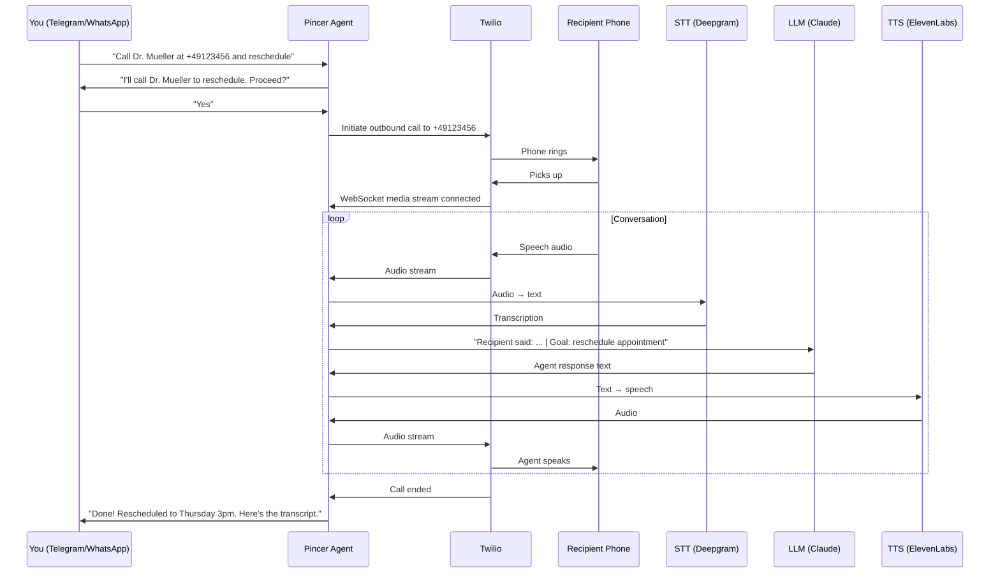

# Voice Calling

Pincer can make and receive phone calls on your behalf using Twilio. Text your agent "Call the dentist and reschedule my appointment" — it actually dials the number and talks.

> **Version:** 0.7.2 (Sprint 7). Requires Twilio account.

---

## How It Works



---

## Architecture

The voice system runs as a new channel alongside Telegram, WhatsApp, and Discord:

```
PSTN Caller / Outbound Target
        │
   Twilio Voice Platform
   ├─ TwiML Server (FastAPI routes)    ← /voice/webhook, /voice/status
   ├─ ConversationRelay (Phase 1)      ← Twilio handles STT/TTS, text webhook
   └─ Media Streams WS (Phase 2)       ← Raw mu-law audio, custom STT/TTS
        │
   Voice Gateway
   ├─ STT Engine (Deepgram)            ← Streaming transcription
   ├─ TTS Engine (ElevenLabs)          ← Streaming synthesis
   └─ Barge-In Controller              ← VAD-based interrupt detection
        │
   Voice Agent Brain
   ├─ Call State Machine               ← greeting → intent → verify → execute → confirm → end
   ├─ Safety Gates                     ← Mandatory confirmation before actions
   ├─ PII Guard                        ← Mask sensitive data in transcripts
   └─ Transcript Logger                ← Real-time logging + post-call summary
        │
   Existing Pincer Core
   ├─ Agent (ReAct loop)
   ├─ Memory Store
   ├─ Tool Registry (25+ tools)
   └─ Channel Router
```

### Two-Phase Engine

| Aspect | ConversationRelay (Phase 1) | Media Streams (Phase 2) |
|--------|----------------------------|------------------------|
| Complexity | Low — text in/out | High — raw audio |
| Latency | ~2-3s | ~0.8-1.5s |
| Voice quality | Twilio default | ElevenLabs custom voices |
| Barge-in | Basic (Twilio handles) | Advanced (custom VAD) |
| Dependencies | twilio only | twilio + deepgram + elevenlabs |

Set `PINCER_VOICE_ENGINE=conversation_relay` (default) or `PINCER_VOICE_ENGINE=media_streams`.

### Engine decision & latency baseline (Sprint 1)

Per-call latency is instrumented in `pincer/voice/metrics.py` and logged at call end
(`Call latency [CAxxx]: {...}`). Three numbers matter:

| Metric | Definition | Target |
|---|---|---|
| Time-to-first-agent-word | call start → first `send_speech` | < 2s |
| Per-turn round trip | caller utterance received → agent speech starts | < 1.5s mean |
| Barge-in reaction | speech onset during TTS → TTS stopped | < 500ms |

**Measurement procedure** (repeat per engine, ≥ 5 calls each, same network/region):

1. Set `PINCER_VOICE_ENGINE`, run `PINCER_LOG_LEVEL=DEBUG pincer run`.
2. Place calls to a real mobile; hold a ~10-turn conversation; interrupt the agent
   at least twice per call.
3. Collect the `Call latency` log lines; average per engine.
4. Record the numbers in the table below and set the production default accordingly.

**Decision record (DACH production default):**

| Engine | TTFW | Mean turn RTT | Barge-in | Measured on |
|---|---|---|---|---|
| conversation_relay | _pending live measurement_ | _pending_ | _pending_ | — |
| media_streams | _pending live measurement_ | _pending_ | _pending_ | — |

Provisional default: `conversation_relay` (fewest moving parts, no extra provider
keys). Revisit after the live measurement — if media_streams meets its documented
~0.8–1.5s turn latency with stable Deepgram/ElevenLabs EU connectivity, it becomes
the DACH default. The barge-in <500ms target is only achievable on media_streams
(custom VAD, `voice/bargein.py`); ConversationRelay barge-in is Twilio-controlled.

### Call language (Sprint 2: English default, German)

Language is a **parameter of the call**, not a global setting: `make_phone_call(..., language="de")`
produces a call that is German end-to-end — greeting, conversation, confirmations, error
recovery, timeout exits, and the consent announcement. The text agent infers it from the
user's command ("Ruf beim Zahnarzt an…" → `language="de"`); English is the default.

| Variable | Default | Purpose |
|---|---|---|
| `PINCER_VOICE_DEFAULT_LANGUAGE` | `en` | Fallback call language |
| `PINCER_VOICE_SUPPORTED_LANGUAGES` | `en,de` | Allowed values for the tool param |
| `PINCER_VOICE_DE_FORMALITY` | `sie` | German register (Sie-Form default; `du` for informal) |
| `PINCER_ELEVENLABS_VOICE_ID_DE` / `_EN` | — | Per-language TTS voices (fallback: `PINCER_ELEVENLABS_VOICE_ID`) |

Plumbing per engine: ConversationRelay gets per-call `language`/`voice` TwiML attributes
(`de-DE`, plus the language-resolved ElevenLabs voice when one is configured — Sprint 4);
Media Streams runs Deepgram Nova-2 `de` with more generous endpointing (400ms /
utterance-end 1200ms — German compound words and verb-final clauses pause differently),
and ElevenLabs speaks with the German voice on the multilingual `eleven_flash_v2_5` model. All prompts live in `pincer/voice/prompts/{en,de}.py` (`get_prompt(key, lang)`,
English fallback). German comprehension helpers (`pincer/voice/nlu_de.py`) parse relative
dates/times deterministically ("um halb drei" = 14:30, "in acht Tagen" = one week,
"nächste Woche Dienstag") and render dates for TTS ("Dienstag, der achtzehnte August um
vierzehn Uhr dreißig") — raw ISO strings must never reach TTS. German yes/no variants
("ja", "genau", "passt" / "nein", "lieber nicht", "passt nicht") resolve VERIFY.

### German ASR quality spike (T2.5 — run before relying on German media_streams)

Do this in the first days of German rollout; it gates the STT provider decision.

1. **Setup**: `PINCER_VOICE_ENGINE=media_streams`, `language="de"` calls over real 8kHz telephony.
2. **10 test calls**, varied speakers, at least one dialect speaker (e.g. Bavarian/Swabian).
3. Each call reads a fixed phrase set — the phrases that matter commercially:
   - Dates: "Dienstag, der achtzehnte August", "am dritten März", "übermorgen um halb drei"
   - Times: "vierzehn Uhr dreißig", "Viertel vor fünf", "dreiviertel vier"
   - Names: "Müller-Lüdenscheidt", "Schmidt", "Yilmaz", "Przybilla"
   - Phone numbers: "null eins sieben sechs — zwölf, vierunddreißig, sechsundfünfzig"
4. **Measure WER** on the transcripts (Levenshtein word distance / reference words); record
   per-category WER in the table below.
5. **Decision rule**: dates/times/numbers WER > 10% or names WER > 20% → evaluate Google STT
   (de) behind the existing `STTProvider` abstraction (`voice/stt.py`) before continuing.

| Category | Deepgram nova-2 `de` WER | Notes |
|---|---|---|
| Dates | _pending live spike_ | |
| Times | _pending_ | |
| Names | _pending_ | |
| Phone numbers | _pending_ | |

### Post-call intelligence (Sprint 3)

After every terminated call — including voicemail, busy, and no-answer — the initiating
user receives a report on their originating channel, **in the language of their command**:

```
✅ Anruf bei Dr. Müller beendet (2:40 Min) — erfolgreich
Ergebnis: Rezept wird morgen zur Abholung bereitgelegt.
Besprochen: …
Zusagen: Gegenseite: Praxis ruft bei Rückfragen zurück
➡️ Soll ich das übernehmen: den Rückruf-Termin in deinen Kalender eintragen? Antworte einfach mit Ja.
📄 Vollständiges Transkript: /transcript CA1234
```

The pipeline (`pincer/voice/postcall.py`): one grounded LLM pass over the transcript +
action log (`pincer/voice/outcome.py`) extracts outcome / key facts / commitments /
follow-up suggestions. Grounding is enforced twice — the extraction prompt forbids
inference, and a mechanical filter drops facts whose content doesn't appear in the
transcript. The structured outcome is stored as a `call_actions` row (`action_type=outcome`)
for audit; extraction failure never blocks the report (basic summary fallback).

- **Memory**: key facts, commitments, and follow-up drafts land in cross-channel memory
  (category `voice_call`, tags `source:voice_call`, `call:<sid>`), so "What did Dr. Müller's
  office say last week?" works from any channel. If retention purges the transcript, the
  notes keep the fact — only the raw transcript reference goes stale.
- **Follow-ups**: suggestions are *proposals* in the report; when the user answers, execution
  runs through the normal agent loop, tool registry, and approval gates — denial leaves no
  side effects. `PINCER_VOICE_AUTO_FOLLOWUP` (default `false`) is reserved for later.
- **Transcript on demand**: the `get_call_transcript` tool ("show me the transcript of the
  last call", `/transcript CAxxx`) returns the persisted transcript, PII-masked.

### Live-PSTN release checklist (5 manual calls)

CI runs the simulated 10-scenario suite in `tests/voice_harness/`. Before a
release, additionally sign off these five manual calls from the production number:

1. **Happy path** — outbound call, callee confirms the task; user receives Dialing → Connected → ended-with-outcome messages; transcript shows the task pursued.
2. **Voicemail** — call a number that goes to voicemail; AMD hangs up and the user is told "voicemail detected" (agent must not converse with the greeting).
3. **No answer / busy** — user receives the final status; no stuck call in `/api/apps/twilio/health`.
4. **Mid-call hangup** — callee hangs up mid-sentence; cleanup runs, user gets the final status within seconds.
5. **Barge-in** — interrupt the agent mid-sentence twice; it stops speaking promptly (< 500ms subjective on media_streams) and picks up your input.

---

## Setup

### 1. Install Voice Dependencies

```bash
uv pip install 'pincer-agent[voice]'
```

### 2. Get a Twilio Account

1. Sign up at [twilio.com](https://www.twilio.com)
2. Get a phone number with voice capabilities
3. Note your Account SID and Auth Token

### 3. Configure Pincer

```env
PINCER_VOICE_ENABLED=true
PINCER_TWILIO_ACCOUNT_SID=ACxxxxxxxxxxxxxxxxxxxxxxxxxxxxxxxx
PINCER_TWILIO_AUTH_TOKEN=your-auth-token
PINCER_TWILIO_PHONE_NUMBER=+1234567890
PINCER_VOICE_WEBHOOK_BASE_URL=https://pincer.yourdomain.com
```

### 4. Configure STT/TTS Providers (Phase 2 only)

```env
PINCER_VOICE_ENGINE=media_streams
PINCER_DEEPGRAM_API_KEY=your-deepgram-key
PINCER_ELEVENLABS_API_KEY=your-elevenlabs-key
PINCER_ELEVENLABS_VOICE_ID=pNInz6...    # Optional: specific voice
```

### 5. Set Up Webhook URL

Twilio needs to reach your Pincer instance via HTTPS. Configure your phone number's Voice webhook to:

```
https://pincer.yourdomain.com/api/apps/twilio/webhook
```

**Local development / no public IP:** Pincer has a built-in ngrok integration that opens a tunnel automatically on startup — no manual `ngrok` command needed. See [Local Tunnel (ngrok)](../getting-started/local-tunnel.md) for the full setup, including static domain configuration and the exact Twilio console steps.

### 6. Verify Setup

```bash
pincer doctor
```

The doctor checks Twilio credentials, webhook URL, and recording consent configuration.

---

## Text-Initiated Outbound Calls (Minimal Setup)

If you only want the agent to place calls when you text "Call my dentist" (and do not need inbound calls), use this minimal setup:

**Required:**

- `PINCER_VOICE_OUTBOUND_ENABLED=true`
- `PINCER_TWILIO_ACCOUNT_SID=AC...`
- `PINCER_TWILIO_AUTH_TOKEN=...`
- `PINCER_TWILIO_PHONE_NUMBER=+1...`
- `PINCER_VOICE_WEBHOOK_BASE_URL=https://your-ngrok-or-domain` (public HTTPS URL)
- `uv pip install 'pincer-agent[voice]'`

**Optional:** `PINCER_VOICE_ENABLED=true` — only needed if you want users to call your Twilio number directly (inbound).

**Approval:** The `make_phone_call` tool requires approval on Telegram (you must confirm before the call is placed). On WhatsApp and Discord, it auto-approves.

---

## Usage

### Inbound Calls

Call your Twilio phone number. The agent:
1. Plays a consent announcement (if enabled)
2. Greets the caller
3. Handles the conversation using tools and memory
4. Sends a post-call summary to your preferred text channel

### Outbound Calls

Text your agent on any channel:

```
Call +49 176 12345678 and ask about my prescription refill
```

The agent will:
1. Validate the phone number
2. Ask for your confirmation before dialing
3. Place the call via Twilio
4. Navigate IVR menus if needed
5. Conduct the conversation based on your instructions
6. Report back with a summary and transcript

### Warm Transfer

The agent can call a provider, navigate to the right person, and then patch you in:

```
Call my insurance company at +1-800-555-0123 and get me to the claims department
```

The agent navigates the IVR, waits on hold, and connects you once a human is available.

---

## Call State Machine

Every call follows a deterministic flow:

| Phase | Purpose | Timeout |
|-------|---------|---------|
| RINGING | Call connecting | 30s |
| GREETING | Agent introduces itself | 15s |
| INTENT_CAPTURE | Understand caller's request | 120s |
| FREEFORM | Open conversation (Q&A) | 300s |
| VERIFY | Confirm details before action | 60s |
| EXECUTE | Perform tool call | 30s |
| CONFIRM | Report result | 30s |
| ERROR_RECOVERY | Handle failures gracefully | 30s |
| ENDING | Summarize + goodbye | 15s |

Every tool execution MUST pass through VERIFY first — no silent actions.

---

## Safety & Compliance

### Recording Consent

```env
PINCER_VOICE_RECORDING_ENABLED=true
PINCER_VOICE_CONSENT_MODE=one_party    # one_party | two_party | none
```

When enabled, every call begins with a consent announcement. Two-party consent states (California, etc.) get stricter announcements requiring explicit agreement.

### Confirmation Gates

All consequential actions require verbal confirmation:

| Action | Confirmation Pattern |
|--------|---------------------|
| Spending money | "This will cost $X. Should I go ahead?" |
| Scheduling | "I'll book [date/time]. Confirm?" |
| Sending messages | "I'll send [summary] to [recipient]. OK?" |
| Sharing data | "They're asking for your [data]. Share?" |
| Cancellations | "This will cancel [item]. Are you sure?" |

### PII Protection

Transcripts are automatically scanned for PII and masked before storage:

```
Original: "My card number is 4532 1234 5678 9012"
Stored:   "My card number is 4532 **** **** 9012"
```

Also masks SSNs, PINs, and account numbers.

### Caller ID Allowlist

```env
PINCER_VOICE_ALLOWED_CALLERS=+14155551234,+14155555678
```

Set to `*` (default) to allow all callers.

---

## Voice Providers Comparison

### Speech-to-Text

| Provider | Latency | Accuracy | Cost | Best For |
|----------|---------|----------|------|----------|
| Deepgram | ~300ms | Excellent | $0.0043/min | Default — best balance |
| Google STT | ~400ms | Good | $0.006/min | Enterprise compliance |

### Text-to-Speech

| Provider | Latency | Quality | Cost | Best For |
|----------|---------|---------|------|----------|
| ElevenLabs | ~400ms | Most natural | $0.18/1K chars | Default — best quality |
| Google TTS | ~200ms | Robotic | $0.004/1K chars | Lowest cost |

---

## Phone Contacts Skill

The `phone_contacts` bundled skill provides tools for managing a contact directory:

- `phone_contacts__add_contact` — Add a contact with name, number, category
- `phone_contacts__search_contacts` — Search by name, number, or category
- `phone_contacts__list_contacts` — List all contacts
- `phone_contacts__update_contact` — Update contact details
- `phone_contacts__delete_contact` — Remove a contact

---

## Configuration Reference

| Variable | Required | Default | Description |
|----------|----------|---------|-------------|
| `PINCER_VOICE_ENABLED` | No | `false` | Enable voice channel |
| `PINCER_TWILIO_ACCOUNT_SID` | Yes* | — | Twilio Account SID |
| `PINCER_TWILIO_AUTH_TOKEN` | Yes* | — | Twilio Auth Token |
| `PINCER_TWILIO_PHONE_NUMBER` | Yes* | — | Twilio phone number (E.164) |
| `PINCER_VOICE_ENGINE` | No | `conversation_relay` | Engine type |
| `PINCER_VOICE_WEBHOOK_BASE_URL` | Yes* | — | Public HTTPS URL |
| `PINCER_DEEPGRAM_API_KEY` | Phase 2 | — | Deepgram STT key |
| `PINCER_ELEVENLABS_API_KEY` | Phase 2 | — | ElevenLabs TTS key |
| `PINCER_ELEVENLABS_VOICE_ID` | No | default | Voice selection (global fallback) |
| `PINCER_ELEVENLABS_VOICE_ID_EN` / `_DE` | No | — | Per-language voices |
| `PINCER_ELEVENLABS_MODEL` | No | `eleven_flash_v2_5` | TTS model (multilingual, low latency) |
| `PINCER_ELEVENLABS_STABILITY` / `_SIMILARITY` | No | `0.5` / `0.75` | Voice tuning (0.0–1.0) |
| `PINCER_ELEVENLABS_SPEED` | No | `1.0` | Speaking speed (0.7–1.2) |
| `PINCER_ELEVENLABS_STYLE` | No | `0.0` | Style exaggeration (0 = off, lowest latency) |
| `PINCER_ELEVENLABS_OUTPUT_FORMAT` | No | `ulaw_8000` | Media Streams audio (`pcm_16000` = legacy fallback) |
| `PINCER_CR_TTS_PROVIDER` | No | auto | ConversationRelay TTS: `google`/`amazon`/`elevenlabs` |
| `PINCER_VOICE_LANGUAGE` | No | `en-US` | STT language |
| `PINCER_VOICE_MAX_CALL_DURATION` | No | `600` | Max call seconds |
| `PINCER_VOICE_MAX_HOLD_TIME` | No | `300` | Max IVR hold seconds |
| `PINCER_VOICE_RECORDING_ENABLED` | No | `false` | Enable recording |
| `PINCER_VOICE_CONSENT_MODE` | No | `one_party` | Consent mode |
| `PINCER_VOICE_OUTBOUND_ENABLED` | No | `false` | Enable outbound calls |
| `PINCER_VOICE_OUTBOUND_MAX_DAILY` | No | `10` | Daily outbound limit |
| `PINCER_VOICE_ALLOWED_CALLERS` | No | `*` | Caller allowlist |

*Required when `PINCER_VOICE_ENABLED=true` or `PINCER_VOICE_OUTBOUND_ENABLED=true`.

---

## Costs

A typical 3-minute outbound call costs approximately:

| Component | Cost |
|-----------|------|
| Twilio voice | ~$0.04 |
| STT (Deepgram) | ~$0.013 |
| TTS (ElevenLabs Flash, $0.05/1K chars) | ~$0.05–0.10 |
| LLM (Claude Haiku) | ~$0.02 |
| **Total** | **~$0.12–0.17/call** |

Budget controls apply to voice calls the same as text interactions. Each call's
synthesized character count is tracked in the call metrics (`tts_characters` in the
`Call latency` log line) so ElevenLabs spend per call is auditable.

---

## Troubleshooting

### Bot says "I'm placing the call" but no call is placed

The agent must **invoke the `make_phone_call` tool** to place a real call. If the LLM outputs text that looks like a call (e.g. `<attemptcall>...</attemptcall>` or "I'm placing the call now") without actually calling the tool, no call will be placed.

**Check:**

1. **Logs** — Run with `PINCER_LOG_LEVEL=DEBUG` and look for:
   - `Tools available: [...]` — should include `make_phone_call`
   - `LLM requested tools: ['make_phone_call']` — confirms the model invoked the tool
   - `Tool call: make_phone_call(...)` — confirms execution

2. **Approval** — On Telegram, you must tap **Approve** when the inline keyboard appears. The call is not placed until you approve.

3. **Webhook URL** — `PINCER_VOICE_WEBHOOK_BASE_URL` must be a public HTTPS URL (e.g. ngrok). The startup warns if it is missing.

### Tool runs but bot says "unable to make phone calls"

The tool executed but returned an error. Check logs for the exact cause:

1. **Logs** — Run with `PINCER_LOG_LEVEL=INFO` (or DEBUG) and look for:
   - `make_phone_call aborted:` — validation failed (voice_enabled, webhook, E.164, daily limit)
   - `make_phone_call result:` — shows what the tool returned to the LLM
   - `make_phone_call failed:` — Twilio API threw an exception

2. **Twilio trial account** — Trial accounts can only call **verified numbers**. Add the target number in Twilio Console > Phone Numbers > Verified Caller IDs. Unverified numbers will fail with an error.

3. **Tunnel** — If running locally, confirm the built-in ngrok tunnel is active (`Ngrok tunnel: https://...` in the console) and that `PINCER_VOICE_WEBHOOK_BASE_URL` matches that URL exactly (no trailing slash). Test reachability:
   ```bash
   curl -X POST https://your-tunnel-url/api/apps/twilio/status -d 'CallSid=test'
   ```
   Should return `OK` (200). ngrok free tier may show a browser interstitial on the very first request — use a static domain to avoid it. See [Local Tunnel (ngrok)](../getting-started/local-tunnel.md). Note the ConversationRelay endpoint itself is a WebSocket (`wss://<host>/api/apps/twilio/relay`) — an `https://` URL in the `<ConversationRelay url>` attribute fails at `<Connect>` time with Twilio error 64101 ("application error" right after the greeting).

4. **Twilio Debugger** — Check Twilio Console > Monitor > Logs for call attempts and any webhook or API errors.

---

## Database Tables

Sprint 7 adds four tables (migration `005_sprint7_voice.sql`):

- `voice_calls` — Call sessions with Twilio Call SID, direction, status, timestamps
- `call_transcripts` — Real-time utterance log with speaker, confidence, state
- `call_actions` — Tool calls, DTMF, transfers during voice sessions
- `phone_contacts` — Contact directory for outbound calling
