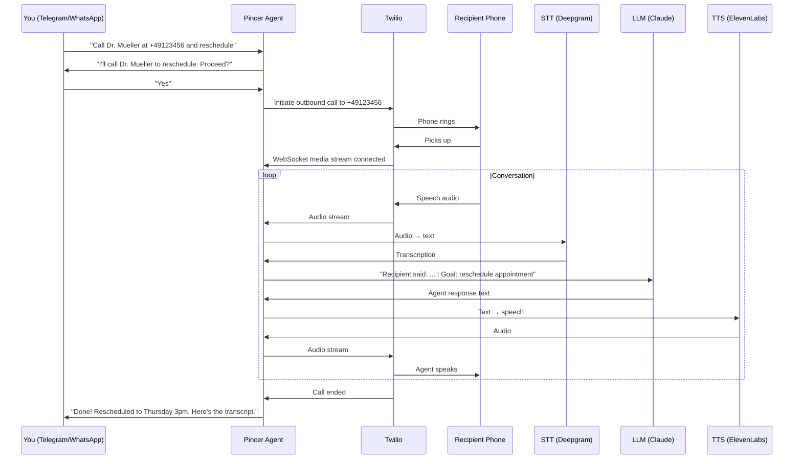

# Voice Calling

Pincer can make and receive phone calls on your behalf using Twilio. Text your agent "Call the dentist and reschedule my appointment" — it actually dials the number and talks.

> **Version:** 0.7.2 (Sprint 7). Requires Twilio account.

---

## How It Works



---

## Architecture

The voice system runs as a new channel alongside Telegram, WhatsApp, and Discord:

```
PSTN Caller / Outbound Target
        │
   Twilio Voice Platform
   ├─ TwiML Server (FastAPI routes)    ← /voice/webhook, /voice/status
   ├─ ConversationRelay (Phase 1)      ← Twilio handles STT/TTS, text webhook
   └─ Media Streams WS (Phase 2)       ← Raw mu-law audio, custom STT/TTS
        │
   Voice Gateway
   ├─ STT Engine (Deepgram)            ← Streaming transcription
   ├─ TTS Engine (ElevenLabs)          ← Streaming synthesis
   └─ Barge-In Controller              ← VAD-based interrupt detection
        │
   Voice Agent Brain
   ├─ Call State Machine               ← greeting → intent → verify → execute → confirm → end
   ├─ Safety Gates                     ← Mandatory confirmation before actions
   ├─ PII Guard                        ← Mask sensitive data in transcripts
   └─ Transcript Logger                ← Real-time logging + post-call summary
        │
   Existing Pincer Core
   ├─ Agent (ReAct loop)
   ├─ Memory Store
   ├─ Tool Registry (25+ tools)
   └─ Channel Router
```

### Two-Phase Engine

| Aspect | ConversationRelay (Phase 1) | Media Streams (Phase 2) |
|--------|----------------------------|------------------------|
| Complexity | Low — text in/out | High — raw audio |
| Latency | ~2-3s | ~0.8-1.5s |
| Voice quality | Twilio default | ElevenLabs custom voices |
| Barge-in | Basic (Twilio handles) | Advanced (custom VAD) |
| Dependencies | twilio only | twilio + deepgram + elevenlabs |

Set `PINCER_VOICE_ENGINE=conversation_relay` (default) or `PINCER_VOICE_ENGINE=media_streams`.

### Engine decision & latency baseline (Sprint 1)

Per-call latency is instrumented in `pincer/voice/metrics.py` and logged at call end
(`Call latency [CAxxx]: {...}`). Three numbers matter:

| Metric | Definition | Target |
|---|---|---|
| Time-to-first-agent-word | call start → first `send_speech` | < 2s |
| Per-turn round trip | caller utterance received → agent speech starts | < 1.5s mean |
| Barge-in reaction | speech onset during TTS → TTS stopped | < 500ms |

**Measurement procedure** (repeat per engine, ≥ 5 calls each, same network/region):

1. Set `PINCER_VOICE_ENGINE`, run `PINCER_LOG_LEVEL=DEBUG pincer run`.
2. Place calls to a real mobile; hold a ~10-turn conversation; interrupt the agent
   at least twice per call.
3. Collect the `Call latency` log lines; average per engine.
4. Record the numbers in the table below and set the production default accordingly.

**Decision record (DACH production default):**

| Engine | TTFW | Mean turn RTT | Barge-in | Measured on |
|---|---|---|---|---|
| conversation_relay | _pending live measurement_ | _pending_ | _pending_ | — |
| media_streams | _pending live measurement_ | _pending_ | _pending_ | — |

Provisional default: `conversation_relay` (fewest moving parts, no extra provider
keys). Revisit after the live measurement — if media_streams meets its documented
~0.8–1.5s turn latency with stable Deepgram/ElevenLabs EU connectivity, it becomes
the DACH default. The barge-in <500ms target is only achievable on media_streams
(custom VAD, `voice/bargein.py`); ConversationRelay barge-in is Twilio-controlled.

### Call language (Sprint 2: English default, German)

Language is a **parameter of the call**, not a global setting: `make_phone_call(..., language="de")`
produces a call that is German end-to-end — greeting, conversation, confirmations, error
recovery, timeout exits, and the consent announcement. The text agent infers it from the
user's command ("Ruf beim Zahnarzt an…" → `language="de"`); English is the default.

| Variable | Default | Purpose |
|---|---|---|
| `PINCER_VOICE_DEFAULT_LANGUAGE` | `en` | Fallback call language |
| `PINCER_VOICE_SUPPORTED_LANGUAGES` | `en,de` | Allowed values for the tool param |
| `PINCER_VOICE_DE_FORMALITY` | `sie` | German register (Sie-Form default; `du` for informal) |
| `PINCER_ELEVENLABS_VOICE_ID_DE` / `_EN` | — | Per-language TTS voices (fallback: `PINCER_ELEVENLABS_VOICE_ID`) |

Plumbing per engine: ConversationRelay gets per-call `language`/`voice` TwiML attributes
(`de-DE`, plus the language-resolved ElevenLabs voice when one is configured — Sprint 4);
Media Streams runs Deepgram Nova-2 `de` with more generous endpointing (400ms /
utterance-end 1200ms — German compound words and verb-final clauses pause differently),
and ElevenLabs speaks with the German voice on the multilingual `eleven_flash_v2_5` model. All prompts live in `pincer/voice/prompts/{en,de}.py` (`get_prompt(key, lang)`,
English fallback). German comprehension helpers (`pincer/voice/nlu_de.py`) parse relative
dates/times deterministically ("um halb drei" = 14:30, "in acht Tagen" = one week,
"nächste Woche Dienstag") and render dates for TTS ("Dienstag, der achtzehnte August um
vierzehn Uhr dreißig") — raw ISO strings must never reach TTS. German yes/no variants
("ja", "genau", "passt" / "nein", "lieber nicht", "passt nicht") resolve VERIFY.

### German ASR quality spike (T2.5 — run before relying on German media_streams)

Do this in the first days of German rollout; it gates the STT provider decision.

1. **Setup**: `PINCER_VOICE_ENGINE=media_streams`, `language="de"` calls over real 8kHz telephony.
2. **10 test calls**, varied speakers, at least one dialect speaker (e.g. Bavarian/Swabian).
3. Each call reads a fixed phrase set — the phrases that matter commercially:
   - Dates: "Dienstag, der achtzehnte August", "am dritten März", "übermorgen um halb drei"
   - Times: "vierzehn Uhr dreißig", "Viertel vor fünf", "dreiviertel vier"
   - Names: "Müller-Lüdenscheidt", "Schmidt", "Yilmaz", "Przybilla"
   - Phone numbers: "null eins sieben sechs — zwölf, vierunddreißig, sechsundfünfzig"
4. **Measure WER** on the transcripts (Levenshtein word distance / reference words); record
   per-category WER in the table below.
5. **Decision rule**: dates/times/numbers WER > 10% or names WER > 20% → evaluate Google STT
   (de) behind the existing `STTProvider` abstraction (`voice/stt.py`) before continuing.

| Category | Deepgram nova-2 `de` WER | Notes |
|---|---|---|
| Dates | _pending live spike_ | |
| Times | _pending_ | |
| Names | _pending_ | |
| Phone numbers | _pending_ | |

### Post-call intelligence (Sprint 3)

After every terminated call — including voicemail, busy, and no-answer — the initiating
user receives a report on their originating channel, **in the language of their command**:

```
✅ Anruf bei Dr. Müller beendet (2:40 Min) — erfolgreich
Ergebnis: Rezept wird morgen zur Abholung bereitgelegt.
Besprochen: …
Zusagen: Gegenseite: Praxis ruft bei Rückfragen zurück
➡️ Soll ich das übernehmen: den Rückruf-Termin in deinen Kalender eintragen? Antworte einfach mit Ja.
📄 Vollständiges Transkript: /transcript CA1234
```

The pipeline (`pincer/voice/postcall.py`): one grounded LLM pass over the transcript +
action log (`pincer/voice/outcome.py`) extracts outcome / key facts / commitments /
follow-up suggestions. Grounding is enforced twice — the extraction prompt forbids
inference, and a mechanical filter drops facts whose content doesn't appear in the
transcript. The structured outcome is stored as a `call_actions` row (`action_type=outcome`)
for audit; extraction failure never blocks the report (basic summary fallback).

- **Memory**: key facts, commitments, and follow-up drafts land in cross-channel memory
  (category `voice_call`, tags `source:voice_call`, `call:<sid>`), so "What did Dr. Müller's
  office say last week?" works from any channel. If retention purges the transcript, the
  notes keep the fact — only the raw transcript reference goes stale.
- **Follow-ups**: suggestions are *proposals* in the report; when the user answers, execution
  runs through the normal agent loop, tool registry, and approval gates — denial leaves no
  side effects. `PINCER_VOICE_AUTO_FOLLOWUP` (default `false`) is reserved for later.
- **Transcript on demand**: the `get_call_transcript` tool ("show me the transcript of the
  last call", `/transcript CAxxx`) returns the persisted transcript, PII-masked.

### Live-PSTN release checklist (5 manual calls)

CI runs the simulated 10-scenario suite in `tests/voice_harness/`. Before a
release, additionally sign off these five manual calls from the production number:

1. **Happy path** — outbound call, callee confirms the task; user receives Dialing → Connected → ended-with-outcome messages; transcript shows the task pursued.
2. **Voicemail** — call a number that goes to voicemail; AMD hangs up and the user is told "voicemail detected" (agent must not converse with the greeting).
3. **No answer / busy** — user receives the final status; no stuck call in `/api/apps/twilio/health`.
4. **Mid-call hangup** — callee hangs up mid-sentence; cleanup runs, user gets the final status within seconds.
5. **Barge-in** — interrupt the agent mid-sentence twice; it stops speaking promptly (< 500ms subjective on media_streams) and picks up your input.

---

## Setup

### 1. Install Voice Dependencies

```bash
uv pip install 'pincer-agent[voice]'
```

### 2. Get a Twilio Account

1. Sign up at [twilio.com](https://www.twilio.com)
2. Get a phone number with voice capabilities
3. Note your Account SID and Auth Token

### 3. Configure Pincer

```env
PINCER_VOICE_ENABLED=true
PINCER_TWILIO_ACCOUNT_SID=ACxxxxxxxxxxxxxxxxxxxxxxxxxxxxxxxx
PINCER_TWILIO_AUTH_TOKEN=your-auth-token
PINCER_TWILIO_PHONE_NUMBER=+1234567890
PINCER_VOICE_WEBHOOK_BASE_URL=https://pincer.yourdomain.com
```

### 4. Configure STT/TTS Providers (Phase 2 only)

```env
PINCER_VOICE_ENGINE=media_streams
PINCER_DEEPGRAM_API_KEY=your-deepgram-key
PINCER_ELEVENLABS_API_KEY=your-elevenlabs-key
PINCER_ELEVENLABS_VOICE_ID=pNInz6...    # Optional: specific voice
```

### 5. Set Up Webhook URL

Twilio needs to reach your Pincer instance via HTTPS. Configure your phone number's Voice webhook to:

```
https://pincer.yourdomain.com/api/apps/twilio/webhook
```

**Local development / no public IP:** Pincer has a built-in ngrok integration that opens a tunnel automatically on startup — no manual `ngrok` command needed. See [Local Tunnel (ngrok)](../getting-started/local-tunnel.md) for the full setup, including static domain configuration and the exact Twilio console steps.

### 6. Verify Setup

```bash
pincer doctor
```

The doctor checks Twilio credentials, webhook URL, and recording consent configuration.

---

## Text-Initiated Outbound Calls (Minimal Setup)

If you only want the agent to place calls when you text "Call my dentist" (and do not need inbound calls), use this minimal setup:

**Required:**

- `PINCER_VOICE_OUTBOUND_ENABLED=true`
- `PINCER_TWILIO_ACCOUNT_SID=AC...`
- `PINCER_TWILIO_AUTH_TOKEN=...`
- `PINCER_TWILIO_PHONE_NUMBER=+1...`
- `PINCER_VOICE_WEBHOOK_BASE_URL=https://your-ngrok-or-domain` (public HTTPS URL)
- `uv pip install 'pincer-agent[voice]'`

**Optional:** `PINCER_VOICE_ENABLED=true` — only needed if you want users to call your Twilio number directly (inbound).

**Approval:** The `make_phone_call` tool requires approval on Telegram (you must confirm before the call is placed). On WhatsApp and Discord, it auto-approves.

---

## Usage

### Inbound Calls

Call your Twilio phone number. The agent:
1. Plays a consent announcement (if enabled)
2. Greets the caller
3. Handles the conversation using tools and memory
4. Sends a post-call summary to your preferred text channel

### Outbound Calls

Text your agent on any channel:

```
Call +49 176 12345678 and ask about my prescription refill
```

The agent will:
1. Validate the phone number
2. Ask for your confirmation before dialing
3. Place the call via Twilio
4. Navigate IVR menus if needed
5. Conduct the conversation based on your instructions
6. Report back with a summary and transcript

**Call briefing.** `purpose` (and the optional `instructions`) are not just
labels: they are injected into the live-call system prompt as a localized
*CALL BRIEFING* block (`CALL_BRIEF` in `voice/prompts/{en,de,uk}.py`). The
agent opens the call by introducing itself and explaining, in its own words,
why it is calling, then works towards the briefing's goal — it never reads
the briefing verbatim and shares only what the other party needs to know.
`target_name` (dashboard "Name" field / `make_phone_call(target_name=...)`)
lets it address the callee by name. Inbound calls have no briefing.

### Ending the call

Calls end the way a human agent ends them, not by timeout:

- The model closes the conversation with a short farewell and the token
  `[END_CALL]` (stripped before TTS, same mechanism as `[SWITCH_LANGUAGE:xx]`).
  Pincer lets the farewell play (estimated from its length), waits
  `PINCER_VOICE_HANGUP_GRACE_S` (default 2 s) and hangs up.
- A farewell from the other party ("okay thanks, bye", "Tschüss", "До побачення")
  is detected deterministically per language. After the agent has already said
  goodbye it is a **mutual goodbye** — hang up after the grace window, no further
  LLM turn. Said first, the next agent turn is a one-sentence goodbye that
  carries the token (and the call ends even if the model forgets it).
- Anything meaningful said during the grace window ("bye — oh wait, one more
  thing") cancels the hangup and the conversation continues.
- The inbound receptionist line keeps its own deterministic endings.

### Call briefing — the task binds the agent

Every outbound call carries a **briefing**: the task the user typed, verbatim.
It is not optional and not advisory.

**Validated at the door.** `make_phone_call`, `POST /api/voice/calls`,
`POST /api/voice/schedule` and the retry scheduler all run the same
`voice/briefing.py::validate_task`. A purpose under 10 characters is refused
with *"Purpose too short — tell the agent concretely what to do on this call."*
(422 from the API, `Error: …` from the tool) and **no call is placed**. There
is no such thing as an outbound call without a task.

**Registered before the dial.** The briefed call state is created *before*
`calls.create()`, parked under a temporary key, and re-keyed to the real
CallSid when Twilio answers. This closes a race that silently broke the
product promise: Twilio can open the ConversationRelay socket before
`calls.create()` returns, and the setup handler that found no state used to
invent a fresh **inbound** one — a generic assistant persona on a call the user
had given a task to, with the briefed state orphaned and nothing logged.

A `setup` that still arrives first waits up to 3 s for the registration, then
falls back to the status record. If the briefing cannot be found at all and
Twilio says the call is `outbound-api`, **the call is terminated** with
`failure_code=briefing_lost` and the user gets the standard failure report. An
unbriefed outbound call is never improvised.

**Binding in the prompt.** `voice/prompt_assembly.py` is the single assembly
function for live-call system prompts — the chat-tool path and the dashboard
path go through it, and a test asserts both produce byte-identical prompts for
identical input. The task renders directly **after the persona and before every
other rule**, as:

```
YOUR TASK FOR THIS CALL (binding):
{the user's text, verbatim}
Rules:
- You made this call to accomplish exactly this task. State the reason for
  your call in your FIRST sentence after the greeting.
- Never describe your general capabilities. Never offer unrelated help.
- …
```

The persona itself also forbids capability talk ("MUST NOT enumerate
features…"), so even a degraded call does not turn into a feature tour. The
TwiML `welcomeGreeting` stays short and generic — the task is stated by the
briefed model on the first turn, never by a static template, so a broken
briefing shows up immediately instead of being papered over.

**Verifiable after the fact.** Each briefed dial logs
`BRIEFING_BOUND call=<sid> chars=<n> source=<s>`; the briefing is persisted
verbatim in `voice_calls.briefing_json` and served at
`GET /api/voice/calls/{sid}` as `briefing`; `GET /api/voice/active` carries
`briefing_task_preview`; and the transcript's first line is
`[BRIEFING] <first 200 chars>`. After the call, a cheap keyword check asks
whether the agent's first three turns referenced the task — if not, it logs
`briefing_adherence_low` and counts it on `pincer.voice.briefing.adherence`.
That check never blocks anything; it is the smoke detector for this whole
mechanism regressing again.

### Warm Transfer

The agent can call a provider, navigate to the right person, and then patch you in:

```
Call my insurance company at +1-800-555-0123 and get me to the claims department
```

The agent navigates the IVR, waits on hold, and connects you once a human is available.

---

## Call State Machine

Every call follows a deterministic flow:

| Phase | Purpose | Timeout |
|-------|---------|---------|
| RINGING | Call connecting | 30s |
| GREETING | Agent introduces itself | 15s |
| INTENT_CAPTURE | Understand caller's request | 120s |
| FREEFORM | Open conversation (Q&A) | 300s |
| VERIFY | Confirm details before action | 60s |
| EXECUTE | Perform tool call | 30s |
| CONFIRM | Report result | 30s |
| ERROR_RECOVERY | Handle failures gracefully | 30s |
| ENDING | Summarize + goodbye | 15s |

Every tool execution MUST pass through VERIFY first — no silent actions.

---

## Safety & Compliance

### Recording Consent

```env
PINCER_VOICE_RECORDING_ENABLED=true
PINCER_VOICE_CONSENT_MODE=one_party    # one_party | two_party | none
```

When enabled, every call begins with a consent announcement. Two-party consent states (California, etc.) get stricter announcements requiring explicit agreement.

### Confirmation Gates

All consequential actions require verbal confirmation:

| Action | Confirmation Pattern |
|--------|---------------------|
| Spending money | "This will cost $X. Should I go ahead?" |
| Scheduling | "I'll book [date/time]. Confirm?" |
| Sending messages | "I'll send [summary] to [recipient]. OK?" |
| Sharing data | "They're asking for your [data]. Share?" |
| Cancellations | "This will cancel [item]. Are you sure?" |

### Tool approval modes (Sprint 11: in-call tool execution)

During a live call the agent can execute an **explicitly allowlisted** set of
tools. The allowlist is a tier table in `src/pincer/voice/tool_policy.py`
(`TIERS`) — the single source of truth; anything not listed is excluded:

| Tier | Tools | Behaviour |
|------|-------|-----------|
| **R** read-only | `google__list_events`, `google__check_freebusy`, `contact_lookup`, `memory_search` (outbound only), `business_profile_lookup` | Runs instantly in every mode, from any phase; a slow read gets a spoken filler first |
| **W** reversible writes | `google__create_event`, `google__update_event`, `send_owner_message`, `memory_note` | Follows the approval mode below; counted against `PINCER_VOICE_MAX_WRITES_PER_CALL` |
| **X** never on a call | `email_send`, `google__delete_event`, `make_phone_call`, `schedule_appointment_call`, `file_*`, `config_*`, `memory_dump`, `do_not_call_*`, **and every unlisted tool** | Not callable — its schema is never passed to the model. No override or extra can change this. |

The LLM only sees the R+W tools inside the call's **purpose scope**:
appointment calls (`schedule_appointment_call`) get the fixed scheduling set;
generic calls (`make_phone_call`, inbound) get all reads plus the two
owner-facing writes — calendar writes are *not* default there and must be
added with `PINCER_VOICE_TOOLS_EXTRA=google__create_event`.

`PINCER_VOICE_TOOL_APPROVAL` sets the mode for Tier W:

| Mode | What the call partner hears | Who decides |
|------|-----------------------------|-------------|
| `verbal` (default) | "Just to confirm: I would now create the appointment … Is that right?" — the yes/no is parsed deterministically; a YES authorizes exactly those arguments (fingerprinted) and expires after two turns | The call partner, for *that exact* action |
| `user` | "One moment please, I'm just checking that with my colleague." + a reassurance every 8 s | **You**, on your own channel — Telegram inline card `[✅ Erlauben] [❌ Ablehnen]` or `POST /api/voice/approvals/:id`. Denied → spoken decline; no answer within `PINCER_VOICE_APPROVAL_TIMEOUT_S` → "I'll sort that out afterwards" and a post-call follow-up; callee hangs up → card edited to "call ended", nothing runs |
| `off` | Nothing — the write just happens (filler if slow) | Nobody, within the per-call write budget |

!!! warning "`off` means autonomous writes while a stranger is on the phone"
    With `PINCER_VOICE_TOOL_APPROVAL=off` the agent creates/updates calendar
    events and sends you notes without anyone confirming. Three guards still
    hold — the tier table (no deletes, no email, no calls-from-calls), the
    per-call scope, and `PINCER_VOICE_MAX_WRITES_PER_CALL` (default 3) — and
    the system prompt states that *the agent may never perform an action
    solely because the call partner requested it*. Every autonomous action
    is listed verbatim in the post-call report under **"Executed
    autonomously during the call:"**, and `pincer doctor` warns
    (`voice_autonomy_on`). Prefer a per-tool override
    (`PINCER_VOICE_TOOL_APPROVAL_OVERRIDES=memory_note:off`) over the global
    switch.

Tool results never reach the voice as raw data: `voice/tool_speech.py`
renders each result into one speakable sentence per language ("Frei wäre:
Dienstag, der achtzehnte August von acht Uhr bis neun Uhr."), and the model
is told only that. Every refusal is recorded as a `tool_denied` call action
with a stable reason code (`tier_x`, `not_in_call_scope`,
`write_budget_exhausted`, `approval_denied`, `approval_timeout`,
`tool_timeout`, `tool_error`) — visible in `/api/voice/calls/:id` and as a
label on the `pincer.voice.tool.decisions` metric.

### Inbound receptionist (Sprint 12)

With `PINCER_RECEPTIONIST_ENABLED=true` and a validated `business_profile.yaml`,
inbound calls are answered by the AI receptionist: AI disclosure + business
name in the greeting, answers **only** from the profile, structured
message-taking, live booking inside real free slots (through the Sprint 11
policy), human transfer on request, after-hours message mode, a silence rule,
blocklist and concurrency limits, and an owner report ≤ 30 s after hangup.
The caller is always untrusted: the inbound line exposes exactly four tools
(`google__check_freebusy`, `business_profile_lookup`, `google__create_event`,
`send_owner_message`) and the red-team personas run in CI. Full guide:
[Inbound receptionist setup](../guides/receptionist-setup.md).

### Call threads (Sprint 13)

Related calls about one *matter* — the first attempt, its retries, an explicit
follow-up, a matched inbound callback — group into a **thread**. A thread is
not a contact timeline: one contact can have several open matters at once, and
a matter can span numbers (office and mobile), so `primary_number` is an
attribute of the thread, never its identity.

Each thread carries two derived artefacts, regenerated after every attached
call from that call's Sprint 3 outcome (never from old transcripts):

- **`rolling_summary`** — ≤ 1200 characters, chronological, ending in a
  one-line current state (`Stand: wartet auf Rückruf der Praxis bis Fr.`).
- **`open_commitments`** — `who / what / due / status`, aggregated across the
  thread. A commitment is only marked `done` when the *new* call contains
  evidence for it; a `due` date in the past flips it to `expired`, which is
  flagged in reports and never acted on automatically.

**Why it exists.** On the next outbound call of the matter, the summary and
open commitments are injected into the live prompt as a `THREAD CONTEXT`
block, so the agent can say "wie am Dienstag besprochen" instead of starting
from zero. The block is added after the language pack is chosen and is bounded
by construction (≤ 1600 chars), so prompt growth is capped no matter how long
the matter runs. The first call of a thread gets no block at all.

**How calls get linked**, certain to fuzzy:

| Mechanism | Attach kind | Certainty |
|---|---|---|
| New outbound task call | `origin` | Certain — creates the thread |
| Sprint 6 retry of the same booking | `retry` | Certain — inherits the origin call's thread |
| `thread_id` passed to `make_phone_call` / `schedule_appointment_call` / the API | `followup` | Certain — user or agent said so |
| Inbound call whose caller ID matches **exactly one** open thread | `inbound_matched` | Heuristic — marked as such |
| Dashboard reassign / merge | `manual` | Certain — a human said so |

Zero matches and two-or-more matches both attach nothing: ambiguity never
guesses, because a silently wrong grouping is worse than no grouping. The same
rule applies in chat — if two open threads match a contact, the agent asks
which one rather than picking.

**Inbound calls are a security boundary.** Caller ID is spoofable, so matching
an inbound call to a thread affects *grouping and reporting only*.
`PINCER_THREAD_INBOUND_CONTEXT` decides what the conversation may know:

- `off` (default) — the receptionist behaves exactly as in Sprint 12: zero
  thread knowledge, nothing spoken.
- `ack` — at most one neutral line ("Ich sehe, wir hatten dazu bereits
  Kontakt."). Never the subject, the summary, dates, or commitments.

A caller who asks what was discussed gets the Sprint 12 privacy deflection in
**both** modes — that is a deterministic tripwire in
`receptionist/session.py`, asserted by the `inbound_thread_probe` red-team
persona, not a prompt instruction the model might talk itself out of.

**Lifecycle.** `open → resolved` when the task succeeds with no open
commitments left (or a human says so); a new attached call reopens a resolved
thread; anything inactive for `PINCER_THREAD_AUTOCLOSE_DAYS` is closed by the
daily `voice_thread_autoclose` job. **Closed is final** — a follow-up on a
closed matter starts a new thread that references the old one in its subject.

**Retention.** Threads follow retention independently of transcripts. The
rolling summary and commitments are derived facts and survive the purge (the
Sprint 3 memory-note precedent); a purged call stays listed in its thread as a
stub (SID, date, outcome code) with no transcript.

**Where to see them.** `GET /api/voice/threads` (`status` takes one value, a
list, or `all`, so a combined "open + resolved" view is one request;
`has_expired_commitments=true` narrows to matters with an overdue commitment),
`GET /api/voice/threads/{id}`
(thread + ordered calls, purged ones flagged), `PATCH` to rename or move
status, `POST …/assign` and `…/merge` for manual corrections. Each thread's
summary is also written to memory under the tag `thread:{id}`, so "Was ist der
Stand bei Dr. Müller?" is answered by ordinary memory search from any channel;
the `thread_lookup` tool finds the `thread_id` to pass to the next call. That
tool is Tier X on calls — the person on the phone must never be able to
enumerate the user's open matters.

### Conversation analytics — talk ratio & sentiment

Every finished call gets a `call_analytics` row: who spoke how much, how often
the caller cut in, and how the caller seemed about the call. It costs no extra
LLM call (sentiment is three more fields on the Sprint 3 outcome pass) and no
audio model.

**The measurement half.**

| Field | Meaning |
|---|---|
| `agent_speech_ms` / `caller_speech_ms` | Audible speech per side |
| `overlap_ms` | Both talking at once — credited to **both**, nobody arbitrates who had the floor |
| `silence_ms` | `duration − (agent + caller − overlap)`, floored at 0 |
| `interruptions` | Barge-in events; exact on both engines |
| `talk_ratio` | `agent / (agent + caller)`, rendered as "Agent 62% · Caller 38%" |
| `method` | `exact` or `estimated` — **always display it** |

`method` is the field that keeps this honest, and it is a property of the
engine, not a label applied afterwards:

- **Media Streams → `exact`.** Agent time is measured from μ-law bytes handed
  to Twilio (8000 bytes = 1 s), minus whatever a barge-in cancelled before it
  could play; caller time comes from Deepgram word timings. Not counting the
  cancelled remainder matters: it would inflate the agent's share precisely on
  the calls where the caller was cutting in.
- **ConversationRelay → `estimated`.** Twilio owns playout and reports nothing
  about it, so durations are inferred from character counts at a per-language
  speaking rate (de 14.5, en 15.5, uk 14.0 chars/s — the only knobs behind
  every estimated number). The UI MUST mark these; an estimate presented as a
  measurement is a claim the interface cannot walk back.

**The sentiment half** is the caller's stance toward *this call and this
matter* — `positive` / `neutral` / `negative` / `mixed`, plus a trajectory
(last third vs first third) and a one-sentence rationale grounded in the
transcript. The extraction prompt forbids character judgements outright:
"frustrated about the repeated delay" is a stance; "an angry person" is not
something this system is allowed to say. A label without a rationale is
discarded rather than shown, because a bare label invites exactly the
over-trust the rationale exists to prevent.

**Absence is never rounded to neutral.** Each of these is a distinct, stored
state (`sentiment_reason`), and the UI must render each of them rather than an
empty box:

| Reason | What happened | Suggested copy |
|---|---|---|
| `not_conversed` | Voicemail, no answer — speech fields are NULL too | "no conversation" |
| `too_short` | Under 10 s of total speech | "call too short to assess" |
| `extraction_failed` | The pass returned nothing usable | "not assessed" |
| *(none)* | Sentiment present | the label + its rationale |

**Copy rules.** "The caller seemed…", never "the caller is…". The word
*estimated* appears wherever `method='estimated'`. No emoji faces — they read
differently across cultures; use a coloured dot and the word.

**Where it surfaces.** `GET /api/voice/calls/{sid}` carries the full
`analytics` object; `GET /api/voice/calls` carries compact `sentiment`,
`talk_ratio` and `method` for list chips; `GET /api/voice/receptionist/stats`
returns the inbound `sentiment_distribution` (counting only assessed calls —
pooling the unassessed would quietly flatter it); thread detail shows each
call's sentiment, with no thread-level synthesis (a thread's story is the
rolling summary's job). Metrics: `pincer.voice.talk_ratio` (labelled by
method), `pincer.voice.sentiment`, `pincer.voice.interruptions`.

**Reporting and alerting are deliberately quiet.** The post-call report adds a
line *only* for a negative reading — a note on every call is noise the owner
learns to skip, and then misses the one that mattered. Three negative calls in
24 h raises a NOTIFY alert (never a page): see the
[runbook](../operations/runbook.md#negative-sentiment).

**Retention.** The numbers and the label are derived facts and survive the
transcript purge. `sentiment_rationale` does not — it quotes what was said, so
the purge NULLs it on the same schedule as the transcript it came from.

Analytics start at deploy. Older calls show "not assessed" rather than being
backfilled from data that was never measured.

### Live listen-in (Sprint 15)

The owner can listen to an active call live from the dashboard — **listen-only,
auditable, compliance-gated, engine-independent**. Off by default.

```
Twilio call ──<Connect> ConversationRelay / Stream──► conversation engine (untouched)
     └──────<Start><Stream track="both_tracks">─────► /api/apps/twilio/monitor/{call_sid}  (rx-only)
                                                        │ per-call fan-out hub (voice/monitor.py)
                                                        ▼
                     browser ◄── WSS /api/voice/listen/{call_sid} (dashboard bearer, listen-only)
```

- **Audio source is a separate Twilio media fork, not the engine.** With
  `PINCER_LISTEN_IN_ENABLED=true` the shared TwiML builder prepends
  `<Start><Stream url="wss://…/api/apps/twilio/monitor/{CallSid}" track="both_tracks"/>`
  to every inbound and outbound call (both engines). The fork is
  fire-and-forget on Twilio's side: our monitor endpoint failing only kills
  monitoring, never the call. A `<Start><Stream>` carries no audio back, so
  barge-in/whisper is impossible by construction.
- **Codec path:** Twilio sends base64 μ-law 8 kHz frames per track
  (`inbound` = the other party, `outbound` = the agent). The server relays
  them untranscoded; the browser decodes μ-law → PCM and plays through an
  `AudioWorklet` with a 300 ms jitter buffer. Target glass-to-ear delay ≤ 1 s.
- **Backpressure:** 50 frames (~1 s) per listener, drop-oldest on a slow
  consumer — audio skips, memory never grows (`pincer.voice.listen.frames_dropped`).
- **Listener cap:** `PINCER_LISTEN_IN_MAX_LISTENERS` (default 2) per call;
  the next listener gets `{"type":"end","reason":"capacity"}` and close code
  4001 ("listener limit reached" in the UI).
- **Auth:** the monitor ingress is Twilio-signed like the relay/stream
  sockets (T8.1 token); the listener socket requires the dashboard bearer on
  the upgrade (`Authorization: Bearer …` or `?token=` — browsers cannot set
  the header on a WebSocket) and is denied with 401 **before** accept. Failed
  attempts count against the T8.2 brute-force guard.
- **Audit, no persistence:** every listen session writes one
  `listen_in_session` audit row `{user, call_sid, started_at, ended_at,
  duration_s, reason, frames, frames_dropped}`. No audio is ever written to
  disk or the database by this path (tested).
- **Compliance:** see [DACH compliance — live listen-in](../guides/dach-compliance.md#live-listen-in-monitoring).
  With `PINCER_LISTEN_IN_ANNOUNCE=true` (default) the call opening gains
  *"This call may be monitored for quality assurance."* / *"Dieses Gespräch
  kann zur Qualitätssicherung mitgehört werden."* Turning the notice off while
  the fork is on is a `pincer doctor` **FAIL** unless two-party recording is
  already announced.
- **API:** `GET /api/voice/active` rows gain `listen_available` (feature on ∧
  fork attached for that call) and `listener_count`; `GET /api/voice/status`
  gains `listen_in_enabled`.
- **Dashboard:** Voice Ops → *Active calls* shows a 🎧 Listen button per call
  (disabled with a tooltip when the feature is off or at capacity). The
  player has Caller/Agent level meters, per-track mute, master mute and stop;
  audio starts only from the click (no auto-listen). On call end it shows
  "Call ended" for 3 s and collapses; on a dropped socket it retries once,
  then shows an error (no reconnect loop).

Wire protocol v1 (JSON text frames, server → client only):

```json
{"type":"start","call_sid":"CA…","tracks":["inbound","outbound"],"codec":"mulaw","sample_rate":8000,"listener_count":1}
{"type":"media","track":"inbound","payload":"<base64 μ-law>","ts":"1234"}
{"type":"end","reason":"call_ended|capacity|unavailable|error"}
```

Not built on purpose: no record/download button, no barge-in or whisper (the
architecture cannot), no listening on ended calls (that is the transcript's
job), no server-side transcoding.

**Manual release checklist (run once per release with listen-in enabled):**

1. Place a live call; the monitoring notice is audible on the call.
2. Open Voice Ops on a second machine, click 🎧 Listen; both tracks play.
3. Measured glass-to-ear delay ≤ 1 s (say a word, time it in the player).
4. Open a third listener: "listener limit reached".
5. Hang up: the player shows "Call ended" and collapses.
6. `SELECT * FROM audit_log WHERE action='listen_in_session'` shows the session row(s).

### PII Protection

Transcripts are automatically scanned for PII and masked before storage:

```
Original: "My card number is 4532 1234 5678 9012"
Stored:   "My card number is 4532 **** **** 9012"
```

Also masks SSNs, PINs, and account numbers.

### Caller ID Allowlist

```env
PINCER_VOICE_ALLOWED_CALLERS=+14155551234,+14155555678
```

Set to `*` (default) to allow all callers.

---

## Voice Providers Comparison

### Speech-to-Text

| Provider | Latency | Accuracy | Cost | Best For |
|----------|---------|----------|------|----------|
| Deepgram | ~300ms | Excellent | $0.0043/min | Default — best balance |
| Google STT | ~400ms | Good | $0.006/min | Enterprise compliance |

### Text-to-Speech

| Provider | Latency | Quality | Cost | Best For |
|----------|---------|---------|------|----------|
| ElevenLabs | ~400ms | Most natural | $0.18/1K chars | Default — best quality |
| Google TTS | ~200ms | Robotic | $0.004/1K chars | Lowest cost |

---

## Phone Contacts Skill

The `phone_contacts` bundled skill provides tools for managing a contact directory:

- `phone_contacts__add_contact` — Add a contact with name, number, category
- `phone_contacts__search_contacts` — Search by name, number, or category
- `phone_contacts__list_contacts` — List all contacts
- `phone_contacts__update_contact` — Update contact details
- `phone_contacts__delete_contact` — Remove a contact

---

## Configuration Reference

| Variable | Required | Default | Description |
|----------|----------|---------|-------------|
| `PINCER_VOICE_ENABLED` | No | `false` | Enable voice channel |
| `PINCER_TWILIO_ACCOUNT_SID` | Yes* | — | Twilio Account SID |
| `PINCER_TWILIO_AUTH_TOKEN` | Yes* | — | Twilio Auth Token |
| `PINCER_TWILIO_PHONE_NUMBER` | Yes* | — | Twilio phone number (E.164) |
| `PINCER_VOICE_ENGINE` | No | `conversation_relay` | Engine type |
| `PINCER_VOICE_WEBHOOK_BASE_URL` | Yes* | — | Public HTTPS URL |
| `PINCER_DEEPGRAM_API_KEY` | Phase 2 | — | Deepgram STT key |
| `PINCER_ELEVENLABS_API_KEY` | Phase 2 | — | ElevenLabs TTS key |
| `PINCER_ELEVENLABS_VOICE_ID` | No | default | Voice selection (global fallback) |
| `PINCER_LISTEN_IN_ENABLED` | No | `false` | Live listen-in: add the rx-only `<Start><Stream>` fork to every call |
| `PINCER_LISTEN_IN_MAX_LISTENERS` | No | `2` | Max concurrent dashboard listeners per call |
| `PINCER_LISTEN_IN_ANNOUNCE` | No | `true` | Add the monitoring notice to the call opening (doctor FAIL if off without two-party recording) |
| `PINCER_ELEVENLABS_VOICE_ID_EN` / `_DE` | No | — | Per-language voices |
| `PINCER_ELEVENLABS_MODEL` | No | `eleven_flash_v2_5` | TTS model (multilingual, low latency) |
| `PINCER_ELEVENLABS_STABILITY` / `_SIMILARITY` | No | `0.5` / `0.75` | Voice tuning (0.0–1.0) |
| `PINCER_ELEVENLABS_SPEED` | No | `1.0` | Speaking speed (0.7–1.2) |
| `PINCER_ELEVENLABS_STYLE` | No | `0.0` | Style exaggeration (0 = off, lowest latency) |
| `PINCER_ELEVENLABS_OUTPUT_FORMAT` | No | `ulaw_8000` | Media Streams audio (`pcm_16000` = legacy fallback) |
| `PINCER_CR_TTS_PROVIDER` | No | auto | ConversationRelay TTS: `google`/`amazon`/`elevenlabs` |
| `PINCER_VOICE_LANGUAGE` | No | `en-US` | STT language |
| `PINCER_VOICE_MAX_CALL_DURATION` | No | `600` | Max call seconds |
| `PINCER_VOICE_HANGUP_GRACE_S` | No | `2.0` | Seconds between the agent's farewell finishing and the hangup (the "both said bye" window) |
| `PINCER_VOICE_MAX_HOLD_TIME` | No | `300` | Max IVR hold seconds |
| `PINCER_VOICE_RECORDING_ENABLED` | No | `false` | Enable recording |
| `PINCER_VOICE_CONSENT_MODE` | No | `one_party` | Consent mode |
| `PINCER_VOICE_OUTBOUND_ENABLED` | No | `false` | Enable outbound calls |
| `PINCER_VOICE_OUTBOUND_MAX_DAILY` | No | `10` | Daily outbound limit |
| `PINCER_VOICE_ALLOWED_CALLERS` | No | `*` | Caller allowlist |
| `PINCER_VOICE_TOOL_APPROVAL` | No | `verbal` | Tier W approval mode on calls: `verbal` / `user` / `off` (Sprint 11) |
| `PINCER_VOICE_TOOL_APPROVAL_OVERRIDES` | No | — | Per-tool modes, CSV `tool:mode` (Tier X tools cannot be configured) |
| `PINCER_VOICE_TOOL_TIMEOUT_S` | No | `10` | Per-tool execution timeout on calls (3–60) |
| `PINCER_VOICE_APPROVAL_TIMEOUT_S` | No | `25` | Max hold time for a `user` approval (10–120) |
| `PINCER_VOICE_MAX_WRITES_PER_CALL` | No | `3` | Tier W write budget per call (0 = writes disabled) |
| `PINCER_VOICE_TOOLS_EXTRA` | No | — | Extra R/W tools added to the call scope (never widens the allowlist) |
| `PINCER_RECEPTIONIST_ENABLED` | No | `false` | Inbound AI receptionist (Sprint 12) |
| `PINCER_BUSINESS_PROFILE` | No | `./business_profile.yaml` | Business profile, validated at startup |
| `PINCER_RECEPTIONIST_BOOKING_APPROVAL` | No | `off` | `off` / `user` for inbound bookings |
| `PINCER_INBOUND_MAX_CONCURRENT` | No | `3` | Busy line above this many active inbound calls |
| `PINCER_INBOUND_RECORDING` | No | `false` | Requires the two-party announcement |
| `PINCER_VOICE_BLOCKLIST` | No | — | CSV of declined caller numbers |
| `PINCER_THREAD_MATCH_WINDOW_DAYS` | No | `7` | Window for matching an inbound call to an open thread by caller ID (0 = never) |
| `PINCER_THREAD_INBOUND_CONTEXT` | No | `off` | What a matched inbound call may know: `off` / `ack` (Sprint 13) |
| `PINCER_THREAD_AUTOCLOSE_DAYS` | No | `30` | Close a thread after this many days of inactivity (0 = never) |

*Required when `PINCER_VOICE_ENABLED=true` or `PINCER_VOICE_OUTBOUND_ENABLED=true`.

---

## Costs

A typical 3-minute outbound call costs approximately:

| Component | Cost |
|-----------|------|
| Twilio voice | ~$0.04 |
| STT (Deepgram) | ~$0.013 |
| TTS (ElevenLabs Flash, $0.05/1K chars) | ~$0.05–0.10 |
| LLM (Claude Haiku) | ~$0.02 |
| **Total** | **~$0.12–0.17/call** |

Budget controls apply to voice calls the same as text interactions. Each call's
synthesized character count is tracked in the call metrics (`tts_characters` in the
`Call latency` log line) so ElevenLabs spend per call is auditable.

---

## Troubleshooting

### Bot says "I'm placing the call" but no call is placed

The agent must **invoke the `make_phone_call` tool** to place a real call. If the LLM outputs text that looks like a call (e.g. `<attemptcall>...</attemptcall>` or "I'm placing the call now") without actually calling the tool, no call will be placed.

**Check:**

1. **Logs** — Run with `PINCER_LOG_LEVEL=DEBUG` and look for:
   - `Tools available: [...]` — should include `make_phone_call`
   - `LLM requested tools: ['make_phone_call']` — confirms the model invoked the tool
   - `Tool call: make_phone_call(...)` — confirms execution

2. **Approval** — On Telegram, you must tap **Approve** when the inline keyboard appears. The call is not placed until you approve.

3. **Webhook URL** — `PINCER_VOICE_WEBHOOK_BASE_URL` must be a public HTTPS URL (e.g. ngrok). The startup warns if it is missing.

### Tool runs but bot says "unable to make phone calls"

The tool executed but returned an error. Check logs for the exact cause:

1. **Logs** — Run with `PINCER_LOG_LEVEL=INFO` (or DEBUG) and look for:
   - `make_phone_call aborted:` — validation failed (voice_enabled, webhook, E.164, daily limit)
   - `make_phone_call result:` — shows what the tool returned to the LLM
   - `make_phone_call failed:` — Twilio API threw an exception

2. **Twilio trial account** — Trial accounts can only call **verified numbers**. Add the target number in Twilio Console > Phone Numbers > Verified Caller IDs. Unverified numbers will fail with an error.

3. **Tunnel** — If running locally, confirm the built-in ngrok tunnel is active (`Ngrok tunnel: https://...` in the console) and that `PINCER_VOICE_WEBHOOK_BASE_URL` matches that URL exactly (no trailing slash). Test reachability:
   ```bash
   curl -X POST https://your-tunnel-url/api/apps/twilio/status -d 'CallSid=test'
   ```
   Should return `OK` (200). ngrok free tier may show a browser interstitial on the very first request — use a static domain to avoid it. See [Local Tunnel (ngrok)](../getting-started/local-tunnel.md). Note the ConversationRelay endpoint itself is a WebSocket (`wss://<host>/api/apps/twilio/relay`) — an `https://` URL in the `<ConversationRelay url>` attribute fails at `<Connect>` time with Twilio error 64101 ("application error" right after the greeting).

4. **Twilio Debugger** — Check Twilio Console > Monitor > Logs for call attempts and any webhook or API errors.

---

## Database Tables

Sprint 7 adds four tables (migration `005_sprint7_voice.sql`):

- `voice_calls` — Call sessions with Twilio Call SID, direction, status, timestamps
- `call_transcripts` — Real-time utterance log with speaker, confidence, state
- `call_actions` — Tool calls, DTMF, transfers during voice sessions
- `phone_contacts` — Contact directory for outbound calling

`voice_calls.briefing_json` (migration `014_call_briefing.sql`) stores the
task each outbound call was given, verbatim.

`call_analytics` (migration `015_call_analytics.sql`) holds per-call talk time,
interruptions and sentiment.

Sprint 13 adds two more (migration `013_call_threads.sql`). Both the API and
the post-call writer run `ensure_voice_tables` before their first query, so a
database whose last write predates the sprint migrates on read rather than
serving an empty call history:

- `call_threads` — One row per matter: subject, status, rolling summary, open commitments
- `call_thread_members` — Which call belongs to which thread; survives the transcript purge
