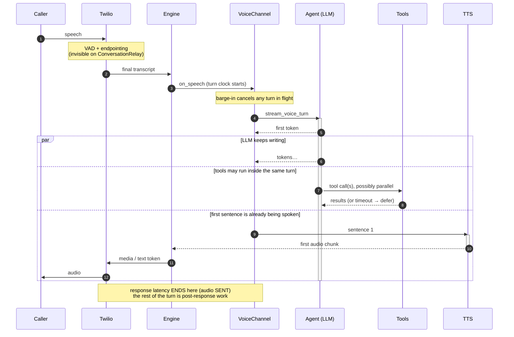

# Telephony pipeline analysis (as implemented)

> Source of truth for the telemetry work. Everything here was read out of the
> code on the `voice` branch — where the code contradicts this document, the
> code wins and this document is wrong.

## 1. Components

| Concern | Module | Notes |
|---|---|---|
| Provider webhooks / WS | `src/pincer/voice/twiml_server.py` | FastAPI router, prefix `/api/apps/twilio` |
| TwiML generation | `src/pincer/voice/twiml_builder.py` | one builder for both engines/directions |
| Engine abstraction | `src/pincer/voice/engine.py` | `VoiceEngine`, `CallState`, two implementations |
| Turn orchestration | `src/pincer/channels/phone_calls.py` | `VoiceChannel`, streaming + blocking turn paths |
| LLM turn | `src/pincer/core/agent.py::stream_voice_turn` | single generation per iteration, tool loop |
| STT | `src/pincer/voice/stt.py` | Deepgram WS (media_streams engine only) |
| TTS | `src/pincer/voice/tts.py` | ElevenLabs WS (media_streams engine only) |
| Sentence cutting | `src/pincer/voice/sentence_stream.py` | LLM tokens -> speakable segments |
| In-call tools | `src/pincer/voice/in_call_tools.py` | tier gate, per-tool timeout, approvals |
| Call phases | `src/pincer/voice/state_machine.py` | `CallPhase`, watchdog timeouts |
| Existing metrics | `src/pincer/voice/metrics.py`, `src/pincer/observability/metrics.py` | in-memory + OTel |

There is exactly one telephony provider: **Twilio**. Two engines sit behind it,
and they are *materially different pipelines* — the single most important fact
for this work.

## 2. The two pipelines

### 2.1 ConversationRelay (`voice_engine=conversation_relay`, the default)

Twilio owns STT and TTS. We exchange **text** over a WebSocket.

```
caller audio ──► Twilio (VAD + endpointing + STT)
                    │  {"type":"prompt","voicePrompt": "..."}   (final text only)
                    ▼
        wss://…/api/apps/twilio/relay  (relay_ws)
                    │
                    ▼
     ConversationRelayEngine.on_speech_input ──► VoiceChannel._handle_speech
                    │
                    ▼
        _handle_speech_turn ──► _run_streaming_turn ──► Agent.stream_voice_turn
                    │                                        │
                    │                                   (LLM tokens)
                    ▼                                        ▼
          SentenceAssembler cuts on sentence boundary ──► send_speech(last=False)
                    │
                    ▼
        {"type":"text","token":"…","last":false,"lang":"de-DE"}
                    │
                    ▼
              Twilio TTS ──► caller
```

Consequences for measurement:

* **We never see caller audio.** No VAD events, no speech-start, no endpointing
  decision, no partial transcripts, no word timings. The first thing we learn
  about a caller utterance is the final transcript, already endpointed by
  Twilio. `analytics_method = "estimated"` on this engine for exactly this
  reason.
* **We never see synthesized audio.** `send_speech` returns `True` when the
  token reached the WebSocket — that is *text handed to Twilio*, not audio
  played to the caller. TTS latency on this engine is Twilio-internal and
  invisible.
* Barge-in is handled by Twilio; we receive `{"type":"interrupt"}` after the
  fact. `ConversationRelayEngine.interrupt_speech` is a no-op that only counts
  the interruption (sending a Media-Streams `clear` here is Twilio error 64107).
* Tokens are buffered by Twilio until `last=true`, so the engine keeps an
  `open_stream` flag and must close the utterance explicitly.

### 2.2 Media Streams (`voice_engine=media_streams`)

We own the whole audio path.

```
caller audio (μ-law 8 kHz, base64, 20 ms frames)
        │  {"event":"media","media":{"payload": "…"}}
        ▼
wss://…/api/apps/twilio/stream/{call_sid}   (media_stream_ws)
        │
        ▼
MediaStreamEngine.on_speech_input ──► audio.mulaw8k_to_pcm16k ──► Deepgram WS
        │                                                            │
        │                          endpointing=300-400 ms, utterance_end=800-1000 ms
        │                                                            ▼
        │                              Results(is_final) / UtteranceEnd  ──┐
        ▼                                                                  │
   _consume_transcripts ──► _handle_final_transcript ──────────────────────┘
        │  (confidence gate: < voice_stt_min_confidence ⇒ ask to repeat)
        ▼
VoiceChannel._handle_speech ──► _run_streaming_turn ──► Agent.stream_voice_turn
        │
        ▼
send_speech(text) ──► split_into_segments ──► _stream_tts
        │                                        │
        │                 ElevenLabs WS (ulaw_8000 native, or pcm_16000 + resample)
        │                                        ▼
        │              {"event":"media","streamSid":…,"media":{"payload": …}}
        ▼                                        │
    Twilio outbound buffer ───────────────────────► caller
```

Consequences:

* Deepgram gives word-level start/end times (`TranscriptWord`), which is why
  `analytics_method = "exact"` here. Speech-end is therefore **observable**.
* `interrupt_speech` cancels the TTS stream and sends Twilio `{"event":"clear"}`
  — this is the only place a buffer-clear actually happens, and Twilio sends no
  acknowledgement for it.
* Time-to-first-audio-chunk is measured today (`_SpeechProgress.first_chunk_ms`,
  `CallMetrics.record_tts_first_chunk`).
* Writing a media frame to the WebSocket is **not** playback. Twilio buffers an
  unbounded amount of outbound audio; there is no `mark` handling in the current
  code, so playback completion is not observed.

> **Neither engine sends Twilio `mark` events today.** Media Streams supports
> them (`{"event":"mark"}` echoed back when the preceding audio finished
> playing); ConversationRelay does not expose an equivalent. So "playback
> acknowledged" is *unavailable on CR* and *available on Media Streams only if
> we start emitting marks* — the telemetry layer models both as an explicit
> capability rather than pretending.

## 2.3 One turn, with the concurrency made explicit

The ASCII flows above are the transport view. This is the *timing* view — what
runs at the same time as what, which is the thing a stacked bar chart of stage
durations would get wrong.



**Read the overlap literally.** `llm.generation` is usually still open when
`tts.synthesis` starts; a turn where they *do not* overlap is a turn that lost
the streaming benefit. This is why `telephony_turns.total_ms` exceeds
`response_latency_ms`, and why stage durations are never summed.

## 3. Call lifecycle

### 3.1 Inbound

```
Twilio POST /api/apps/twilio/webhook   (X-Twilio-Signature verified)
   ├─ allowlist / blocklist / capacity check  ──► decline TwiML + voice_calls row
   ├─ engine.on_call_start(...)   → CallState registered (started_at = now)
   └─ 200 TwiML  <Connect><ConversationRelay|Stream …>
Twilio opens WS ──► relay_ws "setup"  /  media_stream_ws "start"
   └─ engine.mark_call_answered()      ← EVERY CLOCK STARTS HERE
Twilio POST /status  (ringing / in-progress / completed …)
WS close ──► _media_closed ──► engine.end_call ──► VoiceChannel._handle_call_end
```

### 3.2 Outbound

```
tool make_phone_call
   ├─ safety gates (quiet hours, DNC, daily limit, cooldown)
   ├─ engine.register_pending_outbound()   → CallState under a temp id
   ├─ twilio client.calls.create(..., async_amd, status_callback)
   ├─ engine.promote_pending(pre_state, call.sid)   ← still RINGING, no clock
   └─ (ring)
Twilio POST /amd        → AnsweredBy=machine ⇒ hang up, report voicemail
Twilio POST /status     → ringing / in-progress / busy / no-answer / failed
WS "setup" ──► mark_call_answered()  ← re-anchors started_at to pickup,
                                       keeps dialed_at for diagnostics
```

`register` ≠ `answer`. This is already a load-bearing distinction in the code
(`promote_pending`'s comment) and the telemetry must preserve it: **call setup
latency is dial → answer, and the answer timestamp is the WS `setup`/`start`,
not the promotion.**

### 3.3 Termination

`VoiceChannel._handle_call_end` always runs: terminal state machine phase,
truthfulness check, `metrics.finish_call`, failure classification
(`FailureCode`), `record_call_ended` + priced cost row, then the post-call
pipeline as a background task. A "completed" call whose every agent turn was
`undelivered` is reclassified `no_audio`.

## 4. Turn pipeline and where the time goes

`_run_streaming_turn` already stamps monotonic offsets from `t0` (the moment the
transcript reached the channel):

| stamp | set at |
|---|---|
| `prep_ms` | `Agent.stream_voice_turn`: session load + memory + prompt assembly, before the provider request |
| `llm_first_token_ms` | first `StreamEventType.TEXT` |
| `first_sentence_ms` | first complete sentence out of `SentenceAssembler` |
| `first_dispatch_ms` | first non-empty sentence handed to `engine.send_speech` |
| `llm_done_ms` | `StreamEventType.DONE` |
| `total_ms` | end of the whole turn (includes the tail after first audio) |

Written as one `TURN_LATENCY` log line, one JSONL record in
`data/logs/voice_latency.jsonl`, and OTel histograms (`record_turn_latency`).

**Gaps this work has to close:**

1. `t0` is the moment *we* received the final transcript. On Media Streams the
   caller actually stopped speaking earlier (Deepgram word end + endpointing
   delay). So today's `total_ms` under-reports response latency on the engine
   where we can actually measure it.
2. Tool calls are invisible in the stamps. `TOOL_START`/`TOOL_DONE` are yielded
   but never timed, and `InCallToolGate` timeouts/retries/approvals are not in
   the latency record at all. A turn that ran three tools looks like a slow LLM.
3. Overlap is not represented. `llm_done_ms` is frequently *after*
   `first_dispatch_ms` — the model is still writing while the caller already
   hears sentence one. Summing stages double-counts.
4. Nothing is stored per call in a queryable place. The JSONL is the only
   per-turn record and it is not joined to `voice_calls`.
5. Barge-in reaction is recorded in-memory only (`CallMetrics.barge_in_reactions_ms`)
   and nothing ever calls `record_barge_in_reaction`.
6. No correlation ids beyond `call_sid`. No trace/span, no turn id, no provider
   request ids, no deployment version.

## 5. Concurrency, cancellation, retries, timeouts

| Behaviour | Where | Telemetry implication |
|---|---|---|
| Turn runs as its own task `voice-turn-{sid}` | `phone_calls.py` | context must be carried into the task, not read from a global |
| Barge-in cancels the prior turn, then `interrupt_speech` | `_cancel_prior_turn` | two separate events: cancellation and buffer clear |
| Deterministic handlers speak and return early (gate re-ask, receptionist, mutual goodbye) | `_handle_speech_turn` | **not every turn reaches the LLM** — a "turn" with no LLM span is normal, not missing telemetry |
| Buffered drift mode re-runs the whole turn through `check_and_fix` with one regeneration | `_speak_guarded_block` | a second LLM request inside one turn |
| TTS failure retries once, resuming at `segments_done` | `MediaStreamEngine.send_speech` | attempt number belongs on the TTS span |
| STT stream death reconnects once, then ends the call | `_recover_stt_stream` | reconnect event + termination reason |
| Per-tool timeout `voice_tool_timeout_s` (10 s) then defer | `InCallToolGate._execute` | timeout is an outcome, not an error |
| Approval hold `voice_approval_timeout_s` (25 s) with reassurance | `InCallToolGate._user_approval` | this is wall-clock inside a turn and must not read as LLM latency |
| Watchdog reaps phase-inactive calls every 2 s | `_watchdog_loop` | stuck-call termination reason |
| Late Twilio status webhooks for up to 15 min after teardown | `_remember_ended` | **out-of-order events are normal**, not a bug |

## 6. Existing observability inventory

* `pincer/voice/metrics.py` — in-memory `CallMetrics` per call (TTFW, turn
  latencies, barge-in, TTS first chunk, characters). Retains 100 calls, lost on
  restart, not persisted.
* `pincer/observability/metrics.py` — OTel counters/histograms, deliberately
  **no `call_sid` label**. No-op without the `telemetry` extra.
* `pincer/observability/golden_signals.py`, `slo.py`, `alerts.py`, `canary.py`,
  `digest.py`, `ga_gate.py` — SQLite-computed operator signals.
* `pincer/observability/call_costs.py` — priced per-call row.
* `voice_calls` / `call_transcripts` / `call_actions` / `call_analytics` /
  `call_threads` — persisted per call (Alembic 0005-0009).
* Dashboard: `VoiceOps.tsx` (golden signals, alerts, SLO, canary, call list).
* `data/logs/voice_latency.jsonl` + `pincer voice latency-report`.

## 7. Instrumentation points chosen

Numbered points are what the telemetry layer hooks. `CR` / `MS` marks which
engine can produce them.

**Lifecycle**

1. `webhook_received` — inbound `/webhook` entry (CR, MS)
2. `call_registered` — `_register_call` / `register_pending_outbound` (CR, MS)
3. `dial_requested` / `dial_accepted` — around `client.calls.create` (outbound)
4. `provider_status` — every `/status` callback, verbatim status (CR, MS)
5. `amd_verdict` — `/amd` (outbound)
6. `media_stream_open` — `relay_ws` setup / `media_stream_ws` start (CR, MS)
7. `call_answered` — `mark_call_answered` (CR, MS)
8. `first_inbound_audio` — first `media` frame (MS only; **unavailable on CR**)
9. `media_stream_closed` — WS finally block (CR, MS)
10. `call_ended` — `_handle_call_end`, with failure code + termination reason

**Conversation**

11. `stt_speech_end` — last word end of the final transcript (MS only)
12. `stt_final` — final transcript delivered to the channel (CR, MS)
13. `turn_start` — `_handle_speech_turn` entry (CR, MS)
14. `agent_prep_done` — `prep_ms` boundary (CR, MS)
15. `llm_request` / `llm_first_token` / `llm_done` (CR, MS)
16. `tool_start` / `tool_end` per call *and attempt*, with outcome
    (executed / denied / timeout / deferred / approval) (CR, MS)
17. `tts_request` / `tts_first_audio` / `tts_done` (MS only; CR reports
    `text_dispatched` instead)
18. `audio_dispatched` — first byte/token handed to the provider (CR, MS)
19. `playback_mark` — Twilio `mark` echo (MS, only when marks are enabled)
20. `barge_in_detected` / `turn_cancelled` / `buffer_cleared` (CR partial, MS full)
21. `error` / `timeout` / `reconnect` with a stable code (CR, MS)

## 8. What cannot be measured, and why

| Wanted | Status | Reason |
|---|---|---|
| Caller-perceived latency | **Unavailable** | needs an audio probe on the PSTN leg; nothing in-process observes the caller's ear |
| Endpointing delay on CR | **Unavailable** | Twilio does VAD/endpointing; only the final text is delivered |
| STT first-partial on CR | **Unavailable** | interim results are not forwarded by ConversationRelay |
| TTS first-audio on CR | **Unavailable** | Twilio synthesizes; we see no audio |
| Playback completion | **Unavailable by default** | no `mark` events are emitted today (MS could) |
| Transport RTT / jitter / packet loss | **Unavailable** | Twilio terminates the RTP leg; the WS carries no RTP stats |
| Audio gaps | **Partially** (MS) | inter-frame arrival gaps on the inbound media socket are observable |
| Provider-reported latency | **Partially** | Deepgram/ElevenLabs expose request ids, not server-side timings, over their WS APIs |

Everything in that table is surfaced in the UI as `Unavailable` **with the
reason**, never as a zero and never as a silently-omitted row.
